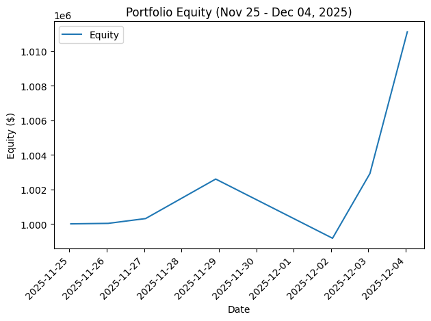
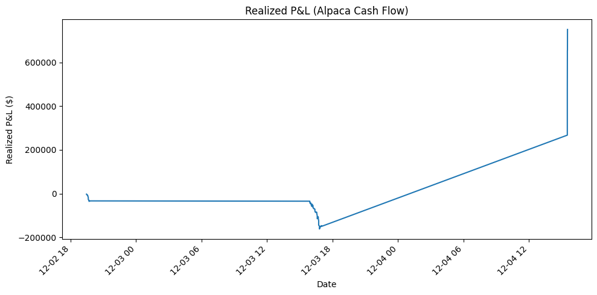

<h1 align = "center"> Live-Trading-Platform </h1>

**Created:**         April 2025  
**Last Edited:**     February 2026  

**Team members:** \
Milad Tootoonchi \
Makka Dulgaeva

***
## Table of Contents

1. [Preface](#preface)
   - [AI-Decleration](#ai-declaration)

2. [Introduction](#introduction)

3. [Background](#background)
   - [Problem Statement](#problem-statement)

4. [Theory and Key Concepts](#theory--key-concepts)
   - [What is FinTech?](#what-is-fintech)
   - [Introduction to Alpaca](#introduction-to-alpaca)
   - [Concepts for Trading Strategies](#concepts-for-strategies)
   - [What Is Backtesting?](#what-is-backtesting)

5. [System Design and Implementation](#backend-design)
   - [Software Design](#software-design)
   - [Machine Learning Architectures](#machine-learning-architectures)
   - [Data and Data Collection](#data--data-collection)

6. [User Manual](#user-manual-how-to-use-the-program)

7. [Results](#results)
   - [Backtesting Results](#backtesting-results)
   - [ML-Model Evaluations](#ml-model-evaluations)
   - [Live Testing](#live-testing)

8. [Discussion](#discussion)
   - [Limitations](#limitations)
   - [Future Work](#future-work)

9. [Conclusion](#conclusion)

10. [References](#references)

<br>

***

## Preface

### AI Declaration

According to NMBU guidelines on the use of artificial intelligence (AI) we confirm the usage of the AI tool ChatGPT as a writing assistant. The tool was applied to improve grammar, sentence clarity, and academic phrasing, but it did not generate content, arguments, or analysis for us. All ideas, data interpretations, and theoretical explanations in the report are our own and based on the sources listed in the reference section. The use of ChatGPT is limited to language refinement and does not influence the academic content of the work.

<br>

***

## Introduction 

The financial markets operate as a vast and intricate system, where millions of traders make decisions in real time, striving to outperform one another. Historically, human intuition and experience dominated this space. Stock exchanges were filled with traders engaging in open outcry, making rapid decisions based on their expertise and instincts. 

However, the landscape has undergone a significant transformation. Human traders are no longer the primary force driving the markets. Instead, algorithmic trading systems have taken precedence operating silently, with extraordinary speed and efficiency. These systems analyze vast quantities of data within milliseconds, executing trades far beyond human capability. 

Despite their perceived complexity, trading algorithms are not a product of chance. They are meticulously designed by financial professionals and engineers, programmed to follow specific strategies and navigate market fluctuations with precision. This project serves as an opportunity to understand the mechanisms behind algorithmic trading, how these systems function, how they execute decisions, and how one can develop a fundamental algorithmic trading model. 

Since the inception of commerce, societies have engaged in trade, progressing from ancient marketplaces to highly sophisticated stock exchanges. Today, finance is experiencing a paradigm shift, largely driven by advancements in technology, changes that occur beyond the immediate perception of most individuals. 

Financial Technology (FinTech) has revolutionized the management of financial transactions, encompassing innovations such as online banking, digital payments, and cryptocurrencies. At the forefront of this revolution is algorithmic trading, wherein computational models, rather than human judgment, dictate trading decisions. 

Modern trading success is no longer solely reliant on human intuition; rather, it is increasingly determined by data analysis, strategic modeling, and automation. This project presents an opportunity to engage with algorithmic trading by designing and testing a Python-based trading model, one that makes objective, data-driven decisions, free from emotional bias. 

<br>

***

## Background

A useful analogy for algorithmic trading is that of a predator in its natural habitat, constantly surveying its surroundings, detecting patterns, and responding with precision. Similarly, an algorithmic trading system continuously monitors market trends, identifies potential opportunities, and executes transactions at high velocity. 

These systems operate around the clock, analyzing stocks, cryptocurrencies, and other financial instruments, identifying price discrepancies that may yield profit. However, despite their efficiency, success in algorithmic trading is not guaranteed. Financial markets are inherently unpredictable, requiring continuous adaptation. A strategy that proves effective today may become obsolete in the future. 

Thus, algorithmic trading systems must undergo regular refinement and optimization, evolving in response to shifting market conditions, much like any adaptive system seeking longterm viability in a competitive environment. This project will allow us to step into this world, to create a trading algorithm and test its survival in a simulated market, where only the most effective strategies endure. 

<br>

### Problem Statement 

Traditional trading methods often depend on manual decision-making processes, which are both time-intensive and prone to human error. In contrast, algorithmic trading utilizes data-driven strategies to improve execution speed, efficiency, and consistency. However, the development of a robust trading algorithm necessitates a comprehensive understanding of several key areas: 

- Financial markets and trading strategies 

- Market data processing and analysis 

- Automated trade execution using APIs 

- Risk management and performance evaluation 

To bridge the gap between theoretical knowledge and practical application, this project aims to develop a Python-based trading bot capable of analyzing market trends, executing trades, and assessing strategy performance within a simulated paper trading environment.

The overall goal is to develop an automated trading system.  
In order to achieve this the following objectives and activities has been set:

1. Research 

    - Conduct a theoretical review of key concepts, including: 
        - Introduction to FinTech 
        - Algorithmic Trading and Market Access 
        - Trading Strategies and Back testing 
        - Introduction to Python for Trading 

    - Identify state-of-the-art open-source solutions through a technical review. 
    - Summarize findings and propose a project specification. 

2. Development/Method 

    - Develop a system for deploying a trading strategy based on selected indicators and predefined rules. 
        - Propose system architecture  
        - Data pipeline- Retrieve, clean, and structure real-time and historical market data using Alpaca’s API. 
        - Development of algorithm  
        - Implement a back testing framework to evaluate the strategy’s effectiveness using historical data. 

    - Deploy the strategy in a simulated trading environment using Alpaca’s paper-trading API. 
    - Summarize findings and insights from the development process. 

3. Evaluation 

    - Suggest a test plan which measure return, risk, and stability based on back testing results and compare with Alpaca’s paper-trading performance. 
        - Analyse the strategy’s robustness by testing it under different market conditions and evaluating its sensitivity to parameter changes. 
        - Assess execution speed and identify potential technical bottlenecks. 
        - Assess key performance metrics, including profit/loss, drawdown, and risk management. 
    - Summarize evaluation results and insights. 

4. Recommendations and Further Work 

    - Provide suggestions for improving the trading strategy based on evaluation results. 
    - Identify areas for future research and potential enhancements, such as alternative indicators, improved risk management, or AI-based optimizations. 

5. Limitations   

    - The project relies on Alpaca’s API for paper trading, which doesn’t account for real-world factors like slippage or liquidity issues. 
    - The use of Python limits performance due to its relative speed compared to other programming languages. 
    - The project focuses mainly on technical indicators, which may not adapt well to changing market conditions. 
    - The back testing framework is based on historical data, which may not predict future market behaviour accurately. 
    - Risk management is limited by predefined parameters and lacks exposure to real capital. 
    - The project refrain from utilizing the shorter strategy in our approach. 

<br>

***

## Theory & Key Concepts

This chapter provides an overview of the key concepts essential for developing an automated trading system. It covers topics such as FinTech, algorithmic trading, trading strategies, and backtesting. Additionally, it introduces Python’s role in implementing trading strategies and interacting with platforms like Alpaca. Understanding these concepts will lay the foundation for creating and evaluating a successful trading strategy. 

<br>

### What is FinTech? 

Financial technology, or fintech, refers to the use of innovative technologies to deliver and improve financial services. From mobile banking and digital wallets to blockchain and algorithmic trading, fintech is transforming how individuals, businesses, and institutions interact with money. 

Driven by advancements in software, data analytics, and connectivity, fintech has disrupted traditional banking models by offering faster, cheaper, and more accessible solutions. It enables everything from peer-to-peer payments and robo-advisors to crowdfunding platforms and decentralized finance (DeFi).

<br>

 \
Figure 1: The usage of FinTech

<br>

At its core, fintech blends finance and technology to increase efficiency, enhance customer experiences, and open up new opportunities for financial inclusion across the globe. As digital adoption continues to rise, fintech is reshaping the future of finance, making it more agile, intelligent, and customer-focused than ever before.

“Algorithmic trading is a process for executing orders utilizing automated and pre-programmed trading instructions to account for variables such as price, timing and volume.

<br>

:max_bytes(150000):strip_icc()/dotdash_Final_Algorithmic_Trading_Apr_2020-01-59aa25326afd47edb2e847c0e18f8ce2.jpg) \
Figure 2: An algorithm is a set of directions for solving a problem. Computer algorithms send small portions of the full order to the market over time.” - Investopedia. 

<br>

### Introduction to Alpaca 
In today’s digital-first economy, efficient and flexible market access is a critical component for individual and institutional investors alike. Market access refers to the ability to interact with and trade within financial markets, including stock exchanges, forex, and derivatives markets. The evolution of financial technology has enabled new forms of market access through APIs, low-latency trading platforms, and algorithmic interfaces, empowering developers and traders to automate strategies and engage with global markets in real time. 

One of the prominent platforms facilitating this innovation is Alpaca Markets. Alpaca is a modern commission free brokerage platform that offers robust APIs for trading U.S. stocks and ETFs. Designed with developers in mind, Alpaca provides real time market data, paper trading environments, and order execution capabilities through simple REST and WebSocket interfaces. Its emphasis on algorithmic and programmatic trading makes it an attractive solution for fintech startups, quantitative traders, and academic researchers exploring financial automation. 

<br>

 \
Figure 3: How Alpaca API works

<br>

By lowering the barriers to entry, Alpaca represents a shift toward democratizing financial markets, offering accessible, scalable, and customizable trading infrastructure. This project explores the fundamentals of market access and highlights how Alpaca Markets enables seamless integration of trading algorithms, portfolio management, and data driven investment strategies. 

<br>

### Concepts for Strategies 

The decision to buy or sell financial securities uses a predetermined algorithm, with the intent to make a profit. In this platform, this algorithm is a python script which can take historical data as an input and give a decision to buy / sell / hold as output. 

In trading, there are several key strategies that guide decision making. These strategies can be automated through algorithmic trading systems, allowing for faster and more efficient execution of trades based on specific signals and market conditions. 

- **Momentum:** This strategy involves buying stocks that are trending upward or selling those that are trending downward, with the expectation that these trends will continue. Traders rely on the idea that strong trends often persist for a period. 

- **Mean Reversion:** Traders using this strategy believe that stock prices will eventually return to their historical average. As a result, they buy stocks that are undervalued and sell those that are overpriced, expecting price corrections. 

- **Moving Average Strategies:** Comparing the stock’s current price with its moving averages (20-day, 50-day, 200-day) to generate buy/sell signals. 

- **RSI (Relative Strength Index):** Used to determine whether a stock is overbought (RSI > 70) or oversold (RSI < 30), providing potential buy/sell signals.

- **MACD (Moving Average Convergence Divergence):** A momentum indicator based on the crossover of the MACD line and the signal line, used for buy/sell decisions.

- **Bollinger Bands:** Utilized to measure stock volatility and potential price movements based on the distance between the upper and lower bands.

- **Rule based strategy:** A simple strategy where the program sends buy / sell / hold signals based on close-price thesholds. Only position data is needed here.

- **Neural nettworks:** A neural network is a type of machine learning model inspired by the human brain, consisting of interconnected nodes, or "neurons," arranged in layers. These networks learn from data by processing information and adjusting the strength of connections between neurons to recognize patterns, make predictions, and solve complex problems.

    - **RNN (LSTM):** A recurrent neural network (RNN) is a type of neural network with a feedback loop that allows it to process sequential data by using past information to influence current outputs. A Long Short-Term Memory (LSTM) is a specialized type of RNN designed to handle long-term dependencies in data more effectively, using memory cells with gates to control the flow of information over time. This ML-model will predict if the stock will rise or fall the next day, a simple classification prediction. The quantity of the order will be calculated seperatly using the probability of the prediction, this model will hold if the quantity is calculated to be 0.

    - **BiLSTM (Bidirectional LSTM):**  
    An extension of LSTM that processes time-series data both forward and backward. This allows the model to learn patterns that depend on both past and future context, improving prediction accuracy for stock price movements.

    - **TCN (Temporal Convolutional Network):**  
    A deep learning model based on causal 1D convolutions for time-series forecasting. TCNs capture long-range dependencies efficiently and are faster to train than recurrent models while maintaining strong performance.

    - **PatchTST:**  
    A transformer-based time-series model that divides price data into patches and applies self-attention. It excels at learning global temporal patterns and is well-suited for multivariate financial time-series prediction.

    - **GNN (Graph Neural Network):**  
    A model that represents stocks as nodes in a graph and learns relationships between them (e.g., sector or correlation). This allows the strategy to exploit inter-stock dependencies when making predictions.

    - **NAD (Neural Anomaly Detection):**  
    A neural network approach used to detect abnormal price movements or market behavior. It can be used to identify unusual trading signals that may indicate breakouts, reversals, or market stress.

    - **CNN-GRU:**  
    A hybrid model where CNN layers extract local price patterns and GRU layers model temporal dependencies. This architecture balances feature extraction and sequential learning for short-term price direction prediction.

- **Ensemble Learning:**  
  Ensemble methods combine multiple decision tree models to produce more accurate and stable predictions than a single model. By aggregating outputs from many trees, these methods reduce overfitting and improve generalization on unseen market data.

    - **XGBoost:**  
    A gradient-boosted decision tree model optimized for performance and speed. It captures non-linear relationships in technical indicators and is commonly used for price direction classification.

    - **Random Forest:**  
    An ensemble of decision trees that reduces overfitting by averaging multiple models. It is robust to noise and works well with engineered technical features.

    - **LightGBM:**  
    A fast, efficient gradient-boosting framework designed for large datasets. It provides high accuracy with low latency, making it suitable for real-time trading signals.

    - **CatBoost:**  
    A gradient-boosting model that handles categorical features effectively and requires minimal preprocessing. It is stable and performs well with limited feature tuning.


<br>

 \
Figure 4: (Ajay, 2022) The figure demonstrates MACD and RSI strategies.

<br>

### What Is Backtesting? 

Backtesting and paper trading are essential steps in developing a successful trading algorithm, as they help evaluate performance before risking real capital. Backtesting involves running a strategy on historical market data to assess its effectiveness, while paper trading allows traders to simulate live market conditions without actual financial risk.

These methods help identify weaknesses, optimize parameters, and build confidence in a strategy. Without proper testing, traders risk deploying flawed algorithms that may perform poorly in real world conditions, leading to significant losses. 

Creating a profitable trading algorithm comes with several challenges, including overfitting and market risks. Overfitting occurs when an algorithm is too closely tailored to past data, making it ineffective in future market conditions. Additionally, market risks such as volatility, slippage, and unexpected economic events can negatively impact a strategy’s performance. Developing a robust algorithm requires careful optimization, risk management techniques, and continuous adaptation to changing market dynamics. Without addressing these challenges, even a well designed algorithm may fail to generate consistent profits. 

<br>

***

## Backend Design

**Tools Used:** 
- Python = ">=3.11,<4.0.0"
- Alpaca

**Python Packages**
```toml
alpaca_trade_api = "*"
alpaca-py = "*"
alpaca = "*"

numpy = "*"
pandas = "*"
requests = "*"
python-dotenv = "*"
toml = "*"
matplotlib = "*"
seaborn = "*"
scikit-learn = "*"
scipy = "*"
tensorflow = "*"
scikeras = "*"

notebook = "*"
ipykernel = "*"
xgboost = "^3.1.3"
lightgbm = "^4.6.0"
joblib = "^1.5.3"
catboost = "^1.2.8"
tenacity = "^9.1.2"
```

**Main Deliverables:**
- A Python-based trading algorithm 
- A backtesting framework for evaluating performance 
- A report on strategy effectiveness and areas for improvement 

**Target Audience:** New students learning about FinTech and algorithmic trading 

**Success Criteria:** A functional trading bot that executes simulated trades with basic performance metrics 

<br>

### Software Design 

 \
Figure 5: The program architecture shows how the different packages communicate with each other. This figure is slightly outdated, however new features will still follow the same rules from the system architecture. The tree-based-models introduced in 0.2.2 will work in the same way as the neural-network-models.

<br>

 \
Figure 6: The diagram shows how the *AlpacaTraders* dependencies on strategy objects, strategies data-pipelines, configurations and other objects.

<br>

### Machine Learning Architectures 

**LSTM**
```
Input (T × F)
   ↓
LSTM (50 units)
   ↓
Dropout (0.2)
   ↓
Dense (1, sigmoid)
   ↓
Binary Up / Down Probability
```

<br>

**Attention BiLSTM**
```
Input (T × F)
   ↓
Bidirectional LSTM (64 units, return sequences)
   ↓
Dropout (0.3)
   ↓
Self-Attention (temporal)
   ↓
Residual Add + Layer Normalization
   ↓
Global Average Pooling
   ↓
Dense (64, ReLU)
   ↓
Dropout (0.3)
   ↓
Dense (1, sigmoid)
```

<br>

**TCN**
```
Input (T × F)
   ↓
Causal Conv1D (32 filters, k=3)
   ↓
Layer Normalization
   ↓
Dropout (0.3)
   ↓
Causal Conv1D (16 filters, k=3)
   ↓
Layer Normalization
   ↓
Global Average Pooling
   ↓
Dense (16, ReLU)
   ↓
Dropout (0.3)
   ↓
Dense (1, sigmoid)
```

<br>

**PatchTST**
```
Input (T × F)
   ↓
Patchify (patch length = 16)
   ↓
Dense Embedding (64)
   ↓
Layer Normalization
   ↓
Multi-Head Self-Attention
   ↓
Residual Add + Layer Normalization
   ↓
Feed-Forward Network
   ↓
Residual Add + Layer Normalization
   ↓
Global Average Pooling
   ↓
Dense (32, ReLU)
   ↓
Dropout (0.3)
   ↓
Dense (1, sigmoid)
```

<br>

**GNN**
```
Input (T × F)
   ↓
Global Average Pooling (temporal)
   ↓
Expand Dimensions (features as nodes)
   ↓
Graph Message Passing (×2 layers)
   ↓
Graph Global Pooling
   ↓
Dense (32, ReLU)
   ↓
Dropout (0.3)
   ↓
Dense (1, sigmoid)
```

<br>

**NAD**
```
Input (T × F)
   ↓
Encoder (Dense → Latent Space)
   ↓
Latent Representation
   ├── Reconstruction Head
   └── Classification Head (sigmoid)
```

<br>

**CNN-GRU**
```
Input (T × F)
   ↓
Conv1D (32 filters)
   ↓
Layer Normalization
   ↓
Dropout (0.3)
   ↓
Conv1D (16 filters)
   ↓
Layer Normalization
   ↓
GRU (32 units)
   ↓
Dense (16, ReLU)
   ↓
Dropout (0.3)
   ↓
Dense (1, sigmoid)
```

<br>

**Tree-Based Ensemble Models (Shared Structure)**
```
Engineered Tabular Features
   ↓
Ensemble of Decision Trees
   ↓
Probability Aggregation
   ↓
Binary Up / Down Probability
```

<br>

**model compile settings** \
Loss: Binary Crossentropy \
Optimizer = Adam (lr = 1e-3) \
Metrics = AUC-ROC and Brier \
Test-evaluation metrics = AUC-ROC, Brier and f1-score

<br>

### Data & Data Collection 
The dataset contains historical stock price information retrieved from the Alpaca API. Each entry includes a timestamp along with standard market fields such as open, high, low, close, volume, trade count, and VWAP. The data is structured as a time series, making it suitable for predictive modeling. All market data are obtained directly from the Alpaca Market Data API, which provides exchange reported price and volume information. The dataset reflects real trading activity and is used both for machine-learning-based prediction and does not include preprocessing for rule-based or financial strategy testing.

Typical issues found in financial time-series data may appear:
- Missing values due to market closures, low-liquidity periods, or incomplete API responses.
- Rolling-window NaNs, which naturally occur when computing SMA, RSI, MACD, and similar indicators.
- Outliers and sharp price movements, reflecting real market volatility.
- Inconsistent or duplicated timestamps, depending on API frequency and sampling settings.
- Distribution mismatch if real-time data is not preprocessed in the exact same way as training data.

<br>

**Preprocessing Steps (Cleaning, Transformations, Feature Engineering)**

This projects pipeline applies structured and repeatable transformations:

1. Timestamp normalization

    - Reset index, convert timestamps to datetime, and re-index the DataFrame using the timestamp.

2. Feature engineering (technical indicators)

    - Moving averages: SMA5, SMA20, SMA50

    - Price change: first difference of close price

    - RSI (14-period)

    - MACD and MACD Signal line (EMA-based)

3. Data cleaning

    - Removal of all rows containing NaN values created by rolling or EMA computations.

4. Target variable construction (training only)

    - Binary target indicating whether the next closing price is higher than the current one.

5. Scaling

    - StandardScaler is fit on the training features.

    - During real-time prediction, the same scaler is used to transform incoming data without refitting.

6. Real-time prediction preparation

    - Applies the identical feature engineering pipeline.

    - Does not create targets and does not refit the scaler.

    - Drops NaNs and returns only the scaled feature matrix for model inference.

* Rule-based / financial strategies

    - These strategies use raw market data and do not involve scaling or preprocessing steps.

<br>

**Challenges and Constraints**

- Minimum data requirements: Indicators like SMAs and RSI require several past observations, reducing usable data at the beginning.

- Real-time consistency: Maintaining identical processing between training and inference is critical to avoid data leakage or drift.

- Volatility and noise: Market noise can weaken predictive performance and require robust feature engineering.

- Potential timestamp irregularities from the Alpaca API, which may affect rolling calculations.

- Computational cost when recalculating indicators continuously for real-time predictions.

- Model sensitivity to scaling errors or missing values if real-time data differ structurally from the training distribution.

<br>

## User Manual (How to use the program)

### **Prerequisites**

**How to Locate Your Alpaca API Keys:**

1. **Log in to Your Alpaca Account**  
   Navigate to the Alpaca website and sign in with your registered username and password.

2. **Access the Dashboard**  
   After logging in, you will be taken to the main dashboard. If not, select **Dashboard** from the menu.

3. **Open the API Keys Section**  
   In the left-hand navigation panel, select **API Keys** or **Your API Keys**, depending on your account view.

4. **Select the Appropriate Environment**  
   Choose between:
   - **Paper Trading** (for testing)
   - **Live Trading** (for real transactions)  
   Each environment has its own set of keys.

5. **Reveal the Keys**  
   Click **Generate** (if no keys exist) or **View**/**Reveal** (if keys are already created).  
   You will see two values:
   - **API Key ID**
   - **Secret Key**

6. **Copy and Store the Keys Securely**  
   Copy both keys and store them in the *settings.toml* file under *[keys]* **section with quote marks around the keys ("*key*")**.  
   *Do not share these keys publicly.*

7. **Regenerate if Needed**  
   If you suspect your keys have been exposed, you can select **Regenerate** to create new ones.  

<br>
<br>

**How to Install the Required Python Packages:**

Follow these short steps to set up your environment:

1. Install Python
    - Make sure Python 3.11 or newer (but < 4.0) is installed:
    ```bash
    python --version
    ```
2. Install Poetry
    - If you do not already have Poetry installed:
    ```bash
    pip install poetry
    ```
    - Verify installation
    ```bash
    poetry --version
    ```
4. Install dependencies
    - This will create a virtual environment and install the locked dependencies:
    ```bash
    poetry install
    ```
    - To update dependencies to newer compatible versions:
    ```bash
    poetry update
    ```

<br>
<br>

**Strategies:** \
This prerequisite is not necessary since the program will ask you for your perfered strategy if the program can not find it in the *settings.toml* file. If you wish to write down your perfered strategy, store the name of the strategy under the *[live]* section as strategy (e.g. strategy = "ai"). **Remember to put quote marks around the strategy name**.  

These are the strategy names you can choose from:  
- rule_based_strategy
- bollinger_bands_strategy
- macd_strategy
- mean_reversion_strategy
- momentum_strategy
- moving_average_strategy
- rsi_strategy

These are the AI strategies (Neural nettwork architecture) you can choose from:
- lstm
- bilstm
- tcn
- patchtst
- gnn
- nad
- cnn_gru

These are the AI strategies (tree-based machine learning models) you can choose from:
- xgboost
- random_forest
- lightgbm
- catboost

<br>

*Warning: the name of the strategy should be exactly similar to one of the strategy names above.*

<br>
<br>

**Watchlist:** \
This feature is optional. If you want the program to always analyze specific stocks, even when you do not currently hold a position, you can define a watchlist.
Add the stock symbols to the [live] section as a Python list, for example:
```toml
[live]
watchlist = "AAPL, GOOG, SPY"
```
Important:
- The list must be enclosed in quotation marks
- Separate symbols with commas

<br>
<br>

**Backtesting Settings** \
To perform a backtest, you need to provide the following variables:
- *backtesting_days* – The number of days in the past you want to include in the backtest.
- *initial_cash* – The starting capital you want to simulate during the backtest.
- *strategy_list* – The strategies you want to evaluate.
We recommend running a backtest on the strategies you are considering using before deploying them live.

Important:
- The strategy list must be enclosed in quotation marks.
- Separate multiple strategies with commas.
- *backtesting_days* and *initial_cash* must be integers.

<br>
<br>


### **User Guide:**

The steps below explain how to use its different command-line options.

1. Open a Terminal
    - Navigate to the main directory where the program is located.

2. Run the Program with a Command.
    - The program accepts several command-line flags.  
    - Use this format:
    ```bash
    poetry run trade [flag]
    ```

- If you need to place an buy-order.
    - `--buy` or `-b`
    ```bash
    poetry run trade --buy
    ```
- If you need to place an sell-order.
    - `--sell` or `-s`
    ```bash
    poetry run trade --sell
    ```

- Cancel last given order (if you regret sending the last given orders)
    - `--cancel-last` or `-cl`
    ```bash
    poetry run trade --cancel-last
    ```

- Cancel all open orders (if you regret sending every recent order)
    - This will cancel **all** open orders.
    - `--cancel` or `-c`
    ```bash
    poetry run trade --cancel
    ```

* Update a specific position or all positions
    - Evaluates specifies / all positions using a strategy chosen at startup. Makes an order based on the evaluation.
    - `--update` or `-u`
    ```bash
    poetry run trade --update [stock symbol, or 'ALL' for all positions]
    ```

* Perform a Backtest
   - Before starting a live trading loop, we recommend running a backtest to evaluate which strategy performs best over your selected time period.
   - `--backtest` or `-bt`
   ```bash
   poetry run trade --backtest
   ```

* Run the Live Trading Loop
    - This will run an update every 60 seconds on ALL positions, in addition to the stocks in the watchlist.
    - `--live` or `-l`
    ```bash
    poetry run trade --live
    ```


<br>
<br>

***

## Results

This chapter presents the results from the one week live-testing, the backtesting of the rule-based strategies, as well as the evaluation of the machine-learning LSTM model. The goal is to provide an overview of how the strategies performed historically and to assess whether the ML model was able to detect short-term price movements. These results also form the basis for later discussion and improvement.

### Backtesting Results 

Backtesting was performed on several different strategies using historical data from TSLA, AVGO, AAPL, NVDA, SPY, AMD, PLTR, INTC and GOOGL. The results clearly show that the strategies vary significantly in terms of total return, risk, and the number of trades executed. The table below summarizes the key performance metrics:

#### Financial-Strategies

<details>
<summary><strong>RSI Strategy</strong></summary>

| Symbol | Total Return (%) | Final Value | Sharpe | Max DD (%) | Trades | Win Rate (%) |
|-------|------------------|-------------|--------|------------|--------|--------------|
| TSLA  | 119.34 | 21,933.96 | 0.98 | -38.79 | 239 | 100.00 |
| AVGO  | 22.95  | 12,295.23 | 0.59 | -17.15 | 91  | 100.00 |
| AAPL  | 13.58  | 11,358.47 | 0.91 | -5.46  | 168 | 100.00 |
| NVDA  | 11.92  | 11,191.68 | 0.40 | -18.12 | 132 | 100.00 |
| SPY   | 11.85  | 11,184.74 | 0.67 | -6.92  | 118 | 100.00 |
| AMD   | 10.48  | 11,047.70 | 0.42 | -11.27 | 199 | 100.00 |
| PLTR  | 1.45   | 10,145.35 | 1.89 | -0.23  | 76  | 100.00 |
| INTC  | -3.33  | 9,667.30  | -0.22 | -7.92 | 227 | 100.00 |
| GOOGL | -66.52 | 3,347.64  | -0.39 | -79.00 | 134 | 98.51 |
| **MEAN** | **13.52** | **11,574.23** | **0.58** | **-20.99** | **154.9** | **99.61** |
| **STD** | **52.11** | **5,675.82** | **0.78** | **26.47** | **60.3** | **0.47** |
| **MEDIAN** | **11.85** | **11,184.74** | **0.67** | **-11.27** | **134** | **100.00** |
| **IQR** | **12.13** | **1,213.27** | **0.49** | **12.66** | **93** | **0.00** |
| **ROBUSTNESS** | **0.98** |  |  |  |  |  |

</details>

<details>
<summary><strong>Mean Reversion Strategy</strong></summary>

| Symbol | Total Return (%) | Final Value | Sharpe | Max DD (%) | Trades | Win Rate (%) |
|-------|------------------|-------------|--------|------------|--------|--------------|
| AVGO  | 67.48 | 16,747.66 | 1.06 | -22.19 | 422 | 93.84 |
| AMD   | 37.97 | 13,797.48 | 0.64 | -21.06 | 714 | 100.00 |
| NVDA  | 36.78 | 13,678.37 | 0.50 | -45.22 | 527 | 100.00 |
| AAPL  | 33.79 | 13,378.69 | 0.94 | -10.42 | 590 | 100.00 |
| SPY   | 15.56 | 11,555.71 | 0.49 | -13.21 | 381 | 96.26 |
| PLTR  | 7.73  | 10,772.62 | 1.70 | -1.27  | 424 | 99.53 |
| INTC  | -10.10| 8,989.70  | -0.25 | -19.69 | 689 | 100.00 |
| TSLA  | -27.38| 7,262.24  | -0.05 | -71.97 | 467 | 92.27 |
| GOOGL | -52.39| 4,760.80  | -0.26 | -71.97 | 436 | 94.50 |
| **MEAN** | **12.16** | **11,216.81** | **0.53** | **-30.33** | **516.7** | **97.82** |
| **STD** | **38.74** | **3,920.46** | **0.67** | **25.94** | **125.1** | **2.93** |
| **MEDIAN** | **15.56** | **11,555.71** | **0.50** | **-21.06** | **467** | **99.53** |
| **IQR** | **22.23** | **2,224.19** | **0.44** | **20.70** | **206** | **3.27** |
| **ROBUSTNESS** | **0.70** |  |  |  |  |  |

</details>

<details>
<summary><strong>Bollinger Bands Strategy</strong></summary>

| Symbol | Total Return (%) | Final Value | Sharpe | Max DD (%) | Trades | Win Rate (%) |
|-------|------------------|-------------|--------|------------|--------|--------------|
| TSLA  | 27.25 | 12,724.55 | 0.71 | -14.78 | 104 | 100.00 |
| AVGO  | 26.15 | 12,614.78 | 1.22 | -7.06  | 64  | 100.00 |
| NVDA  | 16.03 | 11,602.89 | 1.13 | -6.64  | 63  | 100.00 |
| SPY   | 12.54 | 11,254.39 | 0.60 | -8.65  | 78  | 100.00 |
| AAPL  | 7.51  | 10,751.32 | 0.76 | -4.53  | 72  | 100.00 |
| AMD   | 2.35  | 10,235.27 | 0.34 | -4.61  | 76  | 91.43 |
| PLTR  | 0.83  | 10,082.70 | 1.47 | -0.09  | 30  | 100.00 |
| INTC  | 0.28  | 10,028.28 | 0.10 | -1.62  | 97  | 95.45 |
| GOOGL | -92.59| 740.67    | -0.41 | -95.64 | 44  | 90.91 |
| **MEAN** | **0.04** | **9,781.43** | **0.66** | **-15.29** | **69.8** | **97.09** |
| **STD** | **36.27** | **3,713.64** | **0.55** | **29.88** | **23.4** | **3.20** |
| **MEDIAN** | **7.51** | **10,751.32** | **0.76** | **-6.64** | **72** | **100.00** |
| **IQR** | **15.72** | **1,973.07** | **0.78** | **7.12** | **41** | **4.55** |
| **ROBUSTNESS** | **0.48** |  |  |  |  |  |

</details>

<details>
<summary><strong>Moving Average Strategy</strong></summary>

| Symbol | Total Return (%) | Final Value | Sharpe | Max DD (%) | Trades | Win Rate (%) |
|-------|------------------|-------------|--------|------------|--------|--------------|
| PLTR  | 101.85 | 20,185.36 | 1.74 | -7.16  | 233 | 0.00 |
| GOOGL | 42.20  | 14,219.82 | 0.72 | -22.21 | 77  | 0.00 |
| SPY   | 32.65  | 13,264.92 | 1.04 | -9.92  | 40  | 0.00 |
| AAPL  | 24.55  | 12,455.34 | 0.59 | -15.57 | 125 | 0.00 |
| AMD   | 2.11   | 10,211.40 | 0.17 | -39.98 | 133 | 6.38 |
| INTC  | -16.83 | 8,317.17  | -0.69 | -25.38 | 169 | 0.00 |
| TSLA  | -29.40 | 7,060.30  | -0.20 | -60.22 | 85  | 0.00 |
| NVDA  | -47.08 | 5,292.47  | 0.48 | -91.02 | 73  | 0.00 |
| AVGO  | -78.98 | 2,101.50  | -0.06 | -91.66 | 56  | 0.00 |
| **MEAN** | **3.45** | **10,123.59** | **0.42** | **-40.79** | **110.1** | **0.71** |
| **STD** | **56.88** | **5,608.41** | **0.72** | **33.48** | **64.3** | **2.12** |
| **MEDIAN** | **2.11** | **10,211.40** | **0.17** | **-25.38** | **85** | **0.00** |
| **IQR** | **53.06** | **5,394.42** | **0.87** | **44.65** | **96** | **0.00** |
| **ROBUSTNESS** | **0.04** |  |  |  |  |  |

</details>

<details>
<summary><strong>Momentum Strategy</strong></summary>

| Symbol | Total Return (%) | Final Value | Sharpe | Max DD (%) | Trades | Win Rate (%) |
|-------|------------------|-------------|--------|------------|--------|--------------|
| AVGO  | 12.51 | 11,250.60 | 0.48 | -10.36 | 588 | 17.01 |
| AAPL  | 5.22  | 10,522.03 | 1.03 | -2.30  | 553 | 22.55 |
| PLTR  | 2.47  | 10,246.82 | 1.55 | -0.35  | 496 | 23.48 |
| SPY   | 2.34  | 10,234.26 | 0.46 | -2.65  | 394 | 27.04 |
| INTC  | -0.36 | 9,963.56  | -0.24 | -0.99  | 583 | 15.17 |
| AMD   | -1.89 | 9,810.80  | -0.26 | -3.10  | 618 | 16.18 |
| TSLA  | -7.84 | 9,215.57  | -0.27 | -19.79 | 634 | 16.77 |
| GOOGL | -23.81| 7,618.93  | -0.55 | -28.23 | 590 | 18.09 |
| NVDA  | -63.87| 3,612.54  | -0.40 | -71.51 | 682 | 19.94 |
| **MEAN** | **-8.36** | **9,164.57** | **0.20** | **-15.92** | **573.1** | **19.69** |
| **STD** | **25.79** | **2,378.61** | **0.67** | **22.38** | **86.5** | **3.87** |
| **MEDIAN** | **-1.89** | **9,810.80** | **-0.26** | **-10.36** | **588** | **18.09** |
| **IQR** | **17.06** | **1,433.79** | **0.77** | **16.14** | **94** | **5.54** |
| **ROBUSTNESS** | **-0.11** |  |  |  |  |  |

</details>

<details>
<summary><strong>MACD Strategy</strong></summary>

| Symbol | Total Return (%) | Final Value | Sharpe | Max DD (%) | Trades | Win Rate (%) |
|-------|------------------|-------------|--------|------------|--------|--------------|
| SPY   | 0.84  | 10,084.20 | 0.58 | -0.56 | 58 | 55.17 |
| TSLA  | 0.74  | 10,073.54 | 0.12 | -4.66 | 50 | 44.00 |
| AAPL  | 0.54  | 10,053.56 | 0.62 | -0.28 | 60 | 40.00 |
| AMD   | 0.30  | 10,030.39 | 0.23 | -0.46 | 53 | 46.15 |
| PLTR  | 0.29  | 10,028.71 | 1.11 | -0.08 | 48 | 45.83 |
| AVGO  | 0.13  | 10,012.53 | 0.03 | -4.05 | 67 | 30.30 |
| INTC  | 0.02  | 10,001.94 | 0.07 | -0.14 | 45 | 54.55 |
| NVDA  | -4.16 | 9,584.20  | -0.20 | -10.54 | 55 | 37.04 |
| GOOGL | -5.20 | 9,480.15  | -0.60 | -7.76 | 54 | 48.15 |
| **MEAN** | **-0.72** | **9,926.14** | **0.22** | **-3.17** | **54.4** | **44.58** |
| **STD** | **2.29** | **206.71** | **0.54** | **3.76** | **7.1** | **7.87** |
| **MEDIAN** | **0.29** | **10,028.71** | **0.23** | **-0.56** | **53** | **45.83** |
| **IQR** | **0.61** | **58.00** | **0.49** | **1.56** | **12** | **9.58** |
| **ROBUSTNESS** | **0.48** |  |  |  |  |  |

</details>

<br>

#### Tree-Based Models

*These strategies was backtested on the last 30 days before 01.01.2025*

<details>
<summary><strong>XGBoost Strategy</strong></summary>

| Symbol | Total Return (%) | Final Value | Sharpe | Max DD (%) | Trades | Win Rate (%) |
|-------|------------------|-------------|--------|------------|--------|--------------|
| AVGO | 32.39 | 13,238.75 | 3.60 | -10.78 | 4 | 0.00 |
| AAPL | 7.36 | 10,735.66 | 5.93 | -2.71 | 16 | 100.00 |
| TSLA | 1.88 | 10,188.37 | 0.79 | -4.80 | 11 | 0.00 |
| NVDA | 0.05 | 10,005.22 | 1.48 | -0.05 | 11 | 60.00 |
| GOOGL | -0.09 | 9,991.32 | -2.64 | -0.11 | 10 | 40.00 |
| SPY | -0.65 | 9,934.63 | -0.42 | -3.38 | 2 | 0.00 |
| AMD | -1.28 | 9,872.34 | -2.23 | -1.71 | 15 | 33.33 |
| INTC | -16.32 | 8,367.64 | -3.87 | -20.45 | 4 | 0.00 |
| **MEAN** | **2.17** | **10,291.49** | **0.33** | **-5.50** | **9.1** | **29.17** |
| **STD** | **13.47** | **1,454.92** | **3.18** | **7.29** | **5.3** | **36.72** |
| **MEDIAN** | **0.96** | **10,096.80** | **0.18** | **-3.05** | **10.5** | **16.67** |
| **IQR** | **8.64** | **864.35** | **3.51** | **4.29** | **7.0** | **43.33** |
| **ROBUSTNESS** | **0.11** |  |  |  |  |  |

</details>

<details>
<summary><strong>CatBoost Strategy</strong></summary>

| Symbol | Total Return (%) | Final Value | Sharpe | Max DD (%) | Trades | Win Rate (%) |
|-------|------------------|-------------|--------|------------|--------|--------------|
| AVGO | 31.22 | 13,121.67 | 3.61 | -10.44 | 2 | 0.00 |
| TSLA | 26.16 | 12,615.58 | 3.83 | -12.17 | 6 | 100.00 |
| AAPL | 0.07 | 10,007.39 | 4.38 | -0.02 | 7 | 100.00 |
| GOOGL | 0.14 | 10,014.00 | 1.85 | -0.13 | 1 | 0.00 |
| AMD | -0.11 | 9,989.27 | -2.77 | -0.14 | 14 | 57.14 |
| SPY | -0.64 | 9,936.09 | -3.05 | -0.80 | 4 | 0.00 |
| NVDA | -7.86 | 9,214.20 | -2.13 | -11.36 | 2 | 0.00 |
| INTC | -6.73 | 9,326.73 | -1.92 | -11.42 | 18 | 50.00 |
| PLTR | 0.00 | 10,000.00 | 0.00 | 0.00 | 0 | 0.00 |
| **MEAN** | **4.03** | **10,469.21** | **0.98** | **-5.16** | **6.0** | **34.79** |
| **STD** | **13.26** | **1,325.88** | **3.08** | **6.04** | **6.4** | **42.19** |
| **MEDIAN** | **0.07** | **10,007.39** | **1.85** | **-0.80** | **4.0** | **0.00** |
| **IQR** | **13.01** | **1,301.01** | **3.79** | **11.23** | **11.0** | **50.00** |
| **ROBUSTNESS** | **0.01** |  |  |  |  |  |

</details>

<details>
<summary><strong>Random Forest Strategy</strong></summary>

| Symbol | Total Return (%) | Final Value | Sharpe | Max DD (%) | Trades | Win Rate (%) |
|-------|------------------|-------------|--------|------------|--------|--------------|
| GOOGL | 6.17 | 10,617.49 | 3.77 | -0.72 | 8 | 100.00 |
| AAPL  | 0.03 | 10,003.24 | 3.01 | 0.00 | 4 | 100.00 |
| AVGO  | 0.66 | 10,066.17 | 3.21 | -0.31 | 1 | 0.00 |
| SPY   | -0.02 | 9,997.97 | -0.61 | -0.09 | 12 | 66.67 |
| NVDA  | -7.71 | 9,228.76 | -1.95 | -11.87 | 3 | 0.00 |
| AMD   | -12.71 | 8,728.87 | -3.39 | -17.39 | 4 | 0.00 |
| INTC  | -16.79 | 8,320.99 | -3.81 | -22.91 | 4 | 0.00 |
| TSLA  | 0.00 | 10,000.00 | 0.00 | 0.00 | 0 | 0.00 |
| PLTR  | 0.00 | 10,000.00 | 0.00 | 0.00 | 0 | 0.00 |
| **MEAN** | **-3.49** | **9,662.39** | **-0.42** | **-5.48** | **4.0** | **29.63** |
| **STD** | **7.45** | **740.18** | **2.86** | **8.32** | **4.0** | **46.71** |
| **MEDIAN** | **0.00** | **10,000.00** | **0.00** | **-0.31** | **3.0** | **0.00** |
| **IQR** | **6.83** | **683.63** | **3.12** | **10.78** | **4.0** | **66.67** |
| **ROBUSTNESS** | **0.00** |  |  |  |  |  |

</details>

<details>
<summary><strong>LightGBM Strategy</strong></summary>

| Symbol | Total Return (%) | Final Value | Sharpe | Max DD (%) | Trades | Win Rate (%) |
|-------|------------------|-------------|--------|------------|--------|--------------|
| AVGO | 40.71 | 14,071.40 | 3.68 | -12.54 | 3 | 0.00 |
| GOOGL | 11.59 | 11,158.55 | 3.24 | -4.14 | 3 | 0.00 |
| AAPL | 0.02 | 10,001.55 | 0.87 | -0.03 | 12 | 66.67 |
| SPY | -0.68 | 9,931.63 | -0.44 | -3.38 | 2 | 0.00 |
| AMD | -2.31 | 9,769.20 | -1.83 | -3.57 | 11 | 25.00 |
| NVDA | -6.99 | 9,300.64 | -1.79 | -11.14 | 5 | 0.00 |
| TSLA | -10.05 | 8,995.08 | -2.89 | -12.51 | 16 | 20.00 |
| INTC | -17.11 | 8,288.97 | -3.82 | -23.34 | 4 | 0.00 |
| **MEAN** | **1.15** | **10,439.38** | **-0.37** | **-8.83** | **7.0** | **13.96** |
| **STD** | **18.77** | **1,917.40** | **2.67** | **7.71** | **5.2** | **23.68** |
| **MEDIAN** | **-0.33** | **9,850.42** | **-1.11** | **-7.36** | **4.5** | **0.00** |
| **IQR** | **13.90** | **1,389.66** | **3.04** | **8.40** | **6.0** | **20.00** |
| **ROBUSTNESS** | **-0.02** |  |  |  |  |  |

</details>

#### Neural-Network Models

<details>
<summary><strong>CNN-GRU Strategy</strong></summary>

| Symbol | Total Return (%) | Final Value | Sharpe | Max DD (%) | Trades | Win Rate (%) |
|-------|------------------|-------------|--------|------------|--------|--------------|
| TSLA | 16.31 | 11,630.75 | 2.50 | -15.47 | 3 | 0.00 |
| PLTR | 0.13 | 10,012.53 | 2.88 | -0.07 | 5 | 100.00 |
| AVGO | 0.11 | 10,010.89 | 5.67 | 0.00 | 2 | 100.00 |
| SPY | 0.00 | 10,000.04 | 2.90 | 0.00 | 2 | 100.00 |
| GOOGL | -0.08 | 9,992.20 | -1.66 | -0.15 | 8 | 25.00 |
| AMD | -0.15 | 9,984.78 | -3.19 | -0.24 | 9 | 50.00 |
| INTC | -11.23 | 8,876.97 | -4.72 | -13.54 | 2 | 0.00 |
| **MEAN** | **0.84** | **10,072.02** | **0.63** | **-4.21** | **4.4** | **53.57** |
| **STD** | **7.42** | **842.79** | **3.47** | **6.65** | **2.8** | **46.19** |
| **MEDIAN** | **0.11** | **10,010.89** | **2.50** | **-0.15** | **3.0** | **50.00** |
| **IQR** | **0.28** | **27.75** | **3.58** | **0.39** | **3.0** | **75.00** |
| **ROBUSTNESS** | **0.39** |  |  |  |  |  |

</details>

<details>
<summary><strong>PatchTST Strategy</strong></summary>

| Symbol | Total Return (%) | Final Value | Sharpe | Max DD (%) | Trades | Win Rate (%) |
|-------|------------------|-------------|--------|------------|--------|--------------|
| AVGO | 39.95 | 13,995.38 | 3.60 | -12.60 | 3 | 0.00 |
| AAPL | 2.68 | 10,268.45 | 2.43 | -2.02 | 11 | 80.00 |
| GOOGL | 0.14 | 10,014.00 | 1.85 | -0.13 | 1 | 0.00 |
| SPY | -0.02 | 9,997.93 | -0.23 | -0.22 | 1 | 0.00 |
| NVDA | 0.00 | 10,000.00 | 0.00 | 0.00 | 0 | 0.00 |
| TSLA | 0.00 | 10,000.00 | 0.00 | 0.00 | 0 | 0.00 |
| PLTR | 0.00 | 10,000.00 | 0.00 | 0.00 | 0 | 0.00 |
| AMD | 0.00 | 10,000.00 | 0.00 | 0.00 | 0 | 0.00 |
| **MEAN** | **5.34** | **10,534.47** | **0.96** | **-1.87** | **2.0** | **10.00** |
| **STD** | **13.77** | **1,376.72** | **1.69** | **4.19** | **3.7** | **26.46** |
| **MEDIAN** | **0.07** | **10,007.00** | **0.92** | **-0.17** | **1.0** | **0.00** |
| **IQR** | **1.38** | **138.33** | **1.98** | **0.71** | **2.0** | **20.00** |
| **ROBUSTNESS** | **0.05** |  |  |  |  |  |

</details>

<details>
<summary><strong>TCN Strategy</strong></summary>

| Symbol | Total Return (%) | Final Value | Sharpe | Max DD (%) | Trades | Win Rate (%) |
|-------|------------------|-------------|--------|------------|--------|--------------|
| AAPL | 9.37 | 10,937.16 | 5.41 | -3.27 | 3 | 0.00 |
| TSLA | 0.65 | 10,065.10 | 2.22 | -0.75 | 1 | 0.00 |
| AVGO | 0.00 | 10,000.00 | 0.00 | 0.00 | 0 | 0.00 |
| GOOGL | 0.00 | 10,000.00 | 0.00 | 0.00 | 0 | 0.00 |
| NVDA | 0.00 | 10,000.00 | 0.00 | 0.00 | 0 | 0.00 |
| AMD | 0.00 | 10,000.00 | 0.00 | 0.00 | 0 | 0.00 |
| SPY | 0.00 | 10,000.00 | 0.00 | 0.00 | 0 | 0.00 |
| PLTR | 0.00 | 10,000.00 | 0.00 | 0.00 | 0 | 0.00 |
| INTC | 0.00 | 10,000.00 | 0.00 | 0.00 | 0 | 0.00 |
| **MEAN** | **1.11** | **10,111.36** | **0.85** | **-0.45** | **0.4** | **0.00** |
| **STD** | **3.05** | **305.12** | **1.98** | **1.05** | **1.0** | **0.00** |
| **MEDIAN** | **0.00** | **10,000.00** | **0.00** | **0.00** | **0.0** | **0.00** |
| **IQR** | **0.33** | **33.01** | **1.11** | **0.38** | **0.5** | **0.00** |
| **ROBUSTNESS** | **0.00** |  |  |  |  |  |

</details>

<details>
<summary><strong>NAD Strategy</strong></summary>

| Symbol | Total Return (%) | Final Value | Sharpe | Max DD (%) | Trades | Win Rate (%) |
|-------|------------------|-------------|--------|------------|--------|--------------|
| AVGO | 0.66 | 10,066.17 | 3.21 | -0.31 | 1 | 0.00 |
| AAPL | 0.19 | 10,018.73 | 8.39 | 0.00 | 2 | 100.00 |
| AMD | -0.03 | 9,997.23 | -2.90 | -0.03 | 2 | 0.00 |
| SPY | -0.02 | 9,997.93 | -0.23 | -0.22 | 1 | 0.00 |
| TSLA | 0.00 | 10,000.00 | 0.00 | 0.00 | 0 | 0.00 |
| GOOGL | 0.00 | 10,000.00 | 0.00 | 0.00 | 0 | 0.00 |
| NVDA | 0.00 | 10,000.00 | 0.00 | 0.00 | 0 | 0.00 |
| PLTR | 0.00 | 10,000.00 | 0.00 | 0.00 | 0 | 0.00 |
| INTC | 0.00 | 10,000.00 | 0.00 | 0.00 | 0 | 0.00 |
| **MEAN** | **0.09** | **10,008.45** | **0.94** | **-0.06** | **0.7** | **11.11** |
| **STD** | **0.23** | **22.58** | **3.30** | **0.10** | **0.8** | **33.33** |
| **MEDIAN** | **0.00** | **10,000.00** | **0.00** | **0.00** | **0.0** | **0.00** |
| **IQR** | **0.09** | **9.07** | **2.31** | **0.04** | **1.0** | **0.00** |
| **ROBUSTNESS** | **0.00** |  |  |  |  |  |

</details>

<details>
<summary><strong>GNN Strategy</strong></summary>

| Symbol | Total Return (%) | Final Value | Sharpe | Max DD (%) | Trades | Win Rate (%) |
|-------|------------------|-------------|--------|------------|--------|--------------|
| TSLA | 0.65 | 10,065.10 | 2.22 | -0.75 | 1 | 0.00 |
| AAPL | 0.11 | 10,010.83 | 2.70 | -0.09 | 1 | 0.00 |
| AMD | -1.34 | 9,865.54 | -0.36 | -4.75 | 7 | 100.00 |
| INTC | -3.53 | 9,646.74 | -0.93 | -8.50 | 4 | 0.00 |
| GOOGL | -0.06 | 9,993.70 | -5.01 | -0.06 | 1 | 0.00 |
| NVDA | 0.00 | 10,000.00 | 0.00 | 0.00 | 0 | 0.00 |
| SPY | 0.00 | 10,000.00 | 0.00 | 0.00 | 0 | 0.00 |
| PLTR | 0.00 | 10,000.00 | 0.00 | 0.00 | 0 | 0.00 |
| AVGO | 0.00 | 10,000.00 | 0.00 | 0.00 | 0 | 0.00 |
| **MEAN** | **-0.46** | **9,953.77** | **-0.15** | **-1.46** | **1.6** | **11.11** |
| **STD** | **1.34** | **134.41** | **2.45** | **2.92** | **2.6** | **33.33** |
| **MEDIAN** | **0.00** | **10,000.00** | **0.00** | **0.00** | **0.0** | **0.00** |
| **IQR** | **0.38** | **38.21** | **1.81** | **0.60** | **1.5** | **0.00** |
| **ROBUSTNESS** | **0.00** |  |  |  |  |  |

</details>

<details>
<summary><strong>LSTM Strategy</strong></summary>

| Symbol | Total Return (%) | Final Value | Sharpe | Max DD (%) | Trades | Win Rate (%) |
|-------|------------------|-------------|--------|------------|--------|--------------|
| AVGO | 28.82 | 12,881.55 | 3.41 | -3.90 | 7 | 100.00 |
| GOOGL | 0.10 | 10,009.87 | 1.91 | -0.13 | 2 | 100.00 |
| AMD | -13.15 | 8,685.23 | -3.52 | -17.25 | 3 | 0.00 |
| INTC | -17.11 | 8,288.97 | -3.82 | -23.34 | 4 | 0.00 |
| AAPL | 0.00 | 10,000.00 | 0.00 | 0.00 | 0 | 0.00 |
| TSLA | 0.00 | 10,000.00 | 0.00 | 0.00 | 0 | 0.00 |
| NVDA | 0.00 | 10,000.00 | 0.00 | 0.00 | 0 | 0.00 |
| PLTR | 0.00 | 10,000.00 | 0.00 | 0.00 | 0 | 0.00 |
| **MEAN** | **-0.42** | **9,983.70** | **-0.25** | **-5.58** | **2.0** | **25.00** |
| **STD** | **14.80** | **1,506.94** | **2.83** | **9.50** | **2.7** | **46.29** |
| **MEDIAN** | **0.00** | **10,000.00** | **0.00** | **0.00** | **0.0** | **0.00** |
| **IQR** | **7.03** | **703.46** | **1.96** | **8.43** | **3.0** | **50.00** |
| **ROBUSTNESS** | **0.00** |  |  |  |  |  |

</details>


<details>
<summary><strong>BiLSTM Strategy</strong></summary>

| Symbol | Total Return (%) | Final Value | Sharpe | Max DD (%) | Trades | Win Rate (%) |
|-------|------------------|-------------|--------|------------|--------|--------------|
| AVGO | 37.38 | 13,737.99 | 3.67 | -11.82 | 10 | 0.00 |
| GOOGL | 0.16 | 10,016.11 | 2.19 | -0.13 | 2 | 100.00 |
| NVDA | -2.10 | 9,789.66 | -2.70 | -2.24 | 3 | 0.00 |
| INTC | -0.05 | 9,995.21 | -4.65 | -0.06 | 1 | 0.00 |
| AMD | 0.00 | 10,000.00 | 0.00 | 0.00 | 0 | 0.00 |
| AAPL | 0.00 | 10,000.00 | 0.00 | 0.00 | 0 | 0.00 |
| PLTR | 0.00 | 10,000.00 | 0.00 | 0.00 | 0 | 0.00 |
| TSLA | 0.00 | 10,000.00 | 0.00 | 0.00 | 0 | 0.00 |
| **MEAN** | **4.42** | **10,442.37** | **-0.19** | **-1.78** | **2.0** | **12.50** |
| **STD** | **13.59** | **1,365.51** | **2.70** | **3.97** | **3.5** | **35.36** |
| **MEDIAN** | **0.00** | **10,000.00** | **0.00** | **0.00** | **0.0** | **0.00** |
| **IQR** | **2.18** | **216.23** | **2.72** | **1.12** | **3.0** | **25.00** |
| **ROBUSTNESS** | **0.00** |  |  |  |  |  |

</details>

<br>

The RSI strategy remains the strongest overall performer, with the highest returns and good risk-adjusted results across most symbols. Mean Reversion strategies also show positive average performance, but their larger drawdowns and wider spread in results make them less stable. Among the machine-learning models, tree-based methods such as LightGBM, XGBoost, and CatBoost can achieve very high returns in some cases, but their performance is inconsistent and often driven by only a few trades. Deep-learning models like LSTM, CNN-GRU, and GNN generally perform weakly or produce flat results due to low trading activity.
   
Overall, the results suggest that strategies with consistent performance across symbols are more reliable, while high variability and a low number of trades reduce robustness and lead to underperformance.

<br>

### ML-Model Evaluations 

Multiple machine learning and deep learning models were evaluated on the TSLA classification task.  
Given the relatively small test set (53 observations) and class imbalance, the evaluation focuses primarily on **F1-score (class 1)**, **AUC-ROC**, and **Brier score**, rather than accuracy alone.

#### Overall Performance Comparison

| Model          | Accuracy | AUC-ROC | F1 (Class 1) | Brier Score |
|----------------|----------|---------|--------------|-------------|
| Simple LSTM    | 0.585    | 0.574   | **0.645**    | 0.486 |
| GNN            | **0.604**| 0.508   | **0.747**    | **0.404** |
| LightGBM       | 0.528    | 0.511   | 0.603        | 0.482 |
| PatchTST       | 0.453    | 0.416   | 0.567        | 0.467 |
| Random Forest  | 0.453    | 0.432   | 0.540        | 0.482 |
| XGBoost        | 0.491    | 0.505   | 0.509        | 0.514 |
| CatBoost       | 0.434    | 0.458   | 0.423        | 0.526 |
| CNN-GRU        | 0.509    | **0.586**| 0.350        | 0.572 |
| Attention BiLSTM | 0.434  | 0.474   | 0.375        | 0.541 |
| TCN            | 0.396    | 0.492   | 0.059        | 0.596 |
| Naive (NAD)    | 0.396    | 0.500   | 0.000        | 0.604 |

#### Key Observations

- **Simple LSTM and GNN models outperform most alternatives**, particularly in terms of F1-score for class 1, indicating better detection of upward price movements.
- The **GNN model achieves the highest F1-score (0.747)** and the **lowest Brier score**, suggesting strong predictive confidence when forecasting positive returns.
- Tree-based models (LightGBM, Random Forest, XGBoost) demonstrate **moderate and stable performance**, generally close to random guessing in AUC-ROC but with acceptable class-1 F1-scores.
- Several deep learning architectures (e.g., Attention BiLSTM, TCN, CNN-GRU) exhibit **imbalanced behavior**, often favoring one class heavily, which reduces overall robustness.
- The Naive baseline confirms that **class imbalance alone does not explain the results**, as more advanced models consistently outperform it.

#### General Assessment

Overall, most models perform **only marginally above random guessing**, as reflected by AUC-ROC values near 0.5.  
However, models with higher **F1-scores for class 1** may still be practically useful in trading contexts where correctly identifying upward movements is more important than predicting declines.

The results suggest that **model architecture alone is insufficient** to achieve strong predictive power on this dataset. Further improvements would likely require:
- richer feature engineering,
- larger datasets,
- improved regularization,
- and trading-aware evaluation metrics.

Despite modest overall performance, the best-performing models demonstrate **promising directional signal**, particularly in bullish market conditions.


<br>

### Live-Testing 

During the first few days of live-testing, the platform ran on the RSI strategy, which turned out to be very slow and careful. The system waited for the RSI value to move clearly above or below the chosen thresholds before sending any trading signals, which resulted in fewer trades and slower reactions. After three to four days, the strategy was switched over to the LSTM model instead, since it was expected to take on more risk by using predictions from a simple LSTM-50 model. For the test week, the program started with two shares each in AMD, PLTR, INTC, AVGO, NVDA, GOOGL, and SPY. By the end of the week, the realized PnL reached 751,894.59, matching the total PnL, while both account equity and portfolio value ended at 1,010,352.08. This gave a return of around 290.9%. Even though the results look unusually high, the test clearly shows that the AI strategy behaved much more aggressively and caught more short-term market movements compared to the original RSI or other rule based approaches.

realized_pnl        | total_pnl           | equity            | cash                  | portfolio_value      | roi_equity_percent
|-------------------|---------------------|-------------------|-----------------------|----------------------|------------------|
751894.5900000003   | 751894.5900000003   | 1010352.08        | 1010352.08            | 1010352.08           | 290.9161541420221

<br>

 \
Figure 7: This figure shows the daily evolution of total portfolio equity as reported by Alpaca. Equity remains relatively stable during the early part of the period, followed by a sharp increase on December 4, 2025, reflecting the realization of significant trading profits. Minor fluctuations prior to this date are attributable to mark-to-market valuation of open positions.

 \
Figure 8: The figure illustrates cumulative realized P&L reconstructed from Alpaca trade execution cash flows. The pronounced upward movement on December 4, 2025 corresponds to the closing of profitable positions, aligning with the abrupt increase in portfolio equity observed in Figure 7. Temporary drawdowns earlier in the period reflect realized losses from intermediate trade exits.

<br>

***

## Discussion

The results from both backtesting and machine learning evaluation highlight several important strengths and limitations of the developed trading platform. Overall, the project successfully demonstrates a functional algorithmic trading system capable of integrating rule-based strategies, machine learning models, and live market data. However, the findings also reveal clear challenges related to model robustness, data limitations, and strategy generalization.

From the backtesting results, it is evident that rule-based strategies behave very differently depending on market conditions. The RSI strategy stands out as the strongest performer, achieving both the highest total return and a favorable Sharpe ratio. This suggests that momentum based threshold strategies can be highly effective during trending market regimes. In contrast, strategies such as Momentum, Moving Average, and Mean Reversion produced negative returns and large drawdowns, indicating high sensitivity to noise and rapid market fluctuations. These results underline the well known limitation of static indicator based strategies, which often fail to adapt when market dynamics change.

The machine learning evaluation shows that none of the tested models achieved strong predictive performance in an absolute sense. Most models recorded AUC-ROC values close to 0.5, indicating performance only marginally above random guessing. Nevertheless, certain models demonstrated more promising characteristics. The Simple LSTM achieved the most balanced results, with an F1-score of 0.645 for predicting upward movements and an accuracy of approximately 58%. This indicates that the model is able to capture some short term temporal patterns, particularly in bullish scenarios. The GNN model achieved the highest F1-score and the lowest Brier score, suggesting well calibrated probability estimates, but suffered from extreme class imbalance and very limited trade execution, reducing its practical usability.

A key observation across several machine learning models is the mismatch between classification metrics and trading performance. Models that achieved reasonable classification scores often executed very few trades in backtesting, which significantly limited their profitability. This suggests that predictive accuracy alone is insufficient for evaluating trading models and must be considered together with execution frequency, risk exposure, and market conditions. It can therefore be argued that the poor backtesting performance of several machine learning models is at least partly explained by an insufficient number of executed trades rather than purely weak predictive capability.

Live testing further illustrates the behavioral differences between rule-based and machine learning driven strategies. The RSI strategy demonstrated conservative behavior, producing fewer trades and slower reactions to market changes. In contrast, the Simple LSTM strategy was more aggressive and responsive, capturing more short term price movements and generating a substantially higher realized profit during the test period. While the reported returns are unusually high and should not be interpreted as realistic, the live test provides qualitative evidence that machine learning models can produce more dynamic trading behavior than traditional indicator based approaches.

<br>

### Limitations

Despite these encouraging observations, several limitations remain. The models rely exclusively on price derived technical indicators, which restricts their ability to respond to broader market information. In addition, the relatively small dataset and short evaluation period increase the risk of overfitting and reduce statistical reliability. The absence of realistic market frictions, such as slippage and liquidity constraints, further limits the validity of the results in real world trading environments.

In addition to these limitations, the evaluation highlights a clear distinction between technical feasibility and financial realism. While the platform successfully meets its primary objective of developing an automated trading system capable of data ingestion, strategy execution, and performance evaluation, this does not necessarily imply that the resulting strategies are suitable for real capital deployment. The system demonstrates that it is possible to automate trading decisions end-to-end, but the reliability of those decisions remains highly dependent on data quality, evaluation methodology, and market assumptions.

The unusually high returns observed during live-testing further emphasize the importance of cautious interpretation. These results are likely influenced by a combination of factors, including a short evaluation horizon, aggressive position sizing driven by probabilistic model outputs, and the absence of transaction costs, slippage, and liquidity constraints. In real markets, such frictions would significantly reduce realized profits and may even reverse the apparent advantage of more aggressive machine learning–based strategies. Consequently, the live-testing phase should be understood as a behavioral demonstration of strategy dynamics rather than a realistic estimate of achievable performance.

Another important lesson is that increased model complexity does not automatically translate into superior trading outcomes. Several advanced architectures achieved reasonable classification metrics but failed to generate consistent trading activity, resulting in weak or flat backtesting performance. This highlights the necessity of trading-aware evaluation, where predictive performance must be assessed together with execution frequency, risk exposure, and capital utilization. Without this holistic perspective, models may appear successful in isolation while offering little practical value in a trading context.

<br>

### Future Work 

There are several clear directions for future improvement. It is advised that anyone attempting to recreate the program should keep the following points in mind for their own versions:

1. **Enhanced program architecture**  
   The current system could benefit from a cleaner object oriented structure. Improving communication between modules would make the codebase easier to extend, debug, and maintain. A more modular design would also support plugging in additional strategies or ML models without restructuring large parts of the system.

2. **Improving the ML pipeline**  
   Adding stronger regularization, experimenting with different window sizes, and applying better validation techniques (e.g., walk-forward validation) would likely make the ML predictions more robust. Additionally, integrating early stopping could prevent overfitting and improve the model's stability during training.

3. **Graphical user interface and visualization tools**
   - Develop a frontend dashboard to reduce reliance on command-line interaction.
   - Display real-time information about open positions, executed trades, and portfolio value.
   - Visualize performance using graphs such as:
     - Cumulative profit and loss (P&L)
     - Equity curves
     - Drawdown charts
     - Trade distribution and frequency plots
   - Add interactive controls (e.g., buttons or toggles) to:
     - Start, pause, or stop trading
     - Enable or disable automated order execution
     - Activate or deactivate specific strategies or ML models
   - Improve overall usability, monitoring, and debugging during development and experimentation.


Overall, while the platform already demonstrates the core functionality of an algorithmic trading system, there is significant potential for refinement. With improvements in model design, program structure, and risk management, the system could evolve into a more reliable and realistic trading environment capable of supporting more advanced strategies and tools in the future.

<br>

***

## Conclusion

In summary, the platform demonstrates that machine learning can complement traditional trading strategies by introducing adaptability and increased responsiveness to short-term market movements. At the same time, the results clearly show that model complexity alone does not guarantee superior or more stable performance. Rule-based strategies, particularly RSI, proved to be more consistent and interpretable across symbols, while machine learning models exhibited higher variability and sensitivity to data and execution constraints.

More broadly, the project illustrates the challenges of applying predictive models to financial markets, where small statistical edges must overcome noise, transaction costs, and changing market regimes. The findings emphasize that robust data pipelines, careful validation procedures, and trading-aware evaluation metrics are essential prerequisites for reliable algorithmic trading systems. Rather than viewing machine learning as a replacement for traditional strategies, the results support a cautious and incremental approach in which ML models are treated as complementary signal generators within a broader risk-managed framework. This perspective aligns well with real-world quantitative trading practice, where simplicity, robustness, and disciplined evaluation often outperform excessive model complexity.

<br>

***

## References

Alpaca Markets. (2024). *Alpaca API documentation*. https://docs.alpaca.markets/

Hochreiter, S., & Schmidhuber, J. (1997). Long short-term memory. *Neural Computation, 9*(8), 1735–1780. https://doi.org/10.1162/neco.1997.9.8.1735

Hunter, J. D. (2007). Matplotlib: A 2D graphics environment. *Computing in Science & Engineering, 9*(3), 90–95.

McKinney, W. (2010). Data structures for statistical computing in Python. In *Proceedings of the 9th Python in Science Conference* (pp. 51–56). SciPy.

NMBU. (2025). *Retningslinjer for bruk av kunstig intelligens (KI) ved NMBU*. https://www.nmbu.no/retningslinjer-bruk-av-kunstig-intelligens-ki-ved-nmbu

Pedregosa, F., Varoquaux, G., Gramfort, A., Michel, V., Thirion, B., Grisel, O., ... & Duchesnay, É. (2011). Scikit-learn: Machine learning in Python. *Journal of Machine Learning Research, 12*, 2825–2830.

Raschka, S., & Mirjalili, V. (2019). *Python machine learning* (3rd ed.). Packt Publishing.

Seaborn Development Team. (2024). *Seaborn statistical data visualization*. https://seaborn.pydata.org

TensorFlow Team. (2024). *TensorFlow machine learning platform*. https://www.tensorflow.org/

Van Rossum, G., & Drake, F. L. (2009). *Python 3 reference manual*. CreateSpace.

OpenAI. (2025). *ChatGPT (Version 5.1)* [Large language model]. https://www.openai.com  
(*Used as a writing assistant for sentence clarity, structure and wording.*)

Investopedia. (2022). *Algorithmic trading: Definition, how it works, pros & cons*. https://www.investopedia.com
