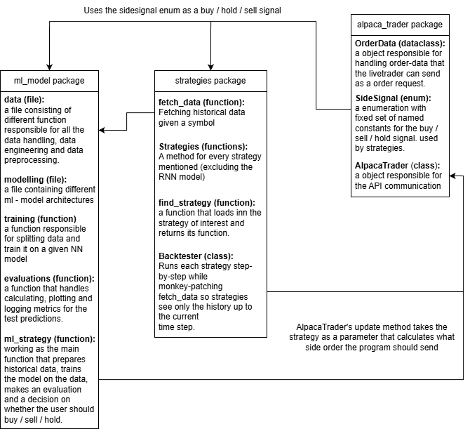
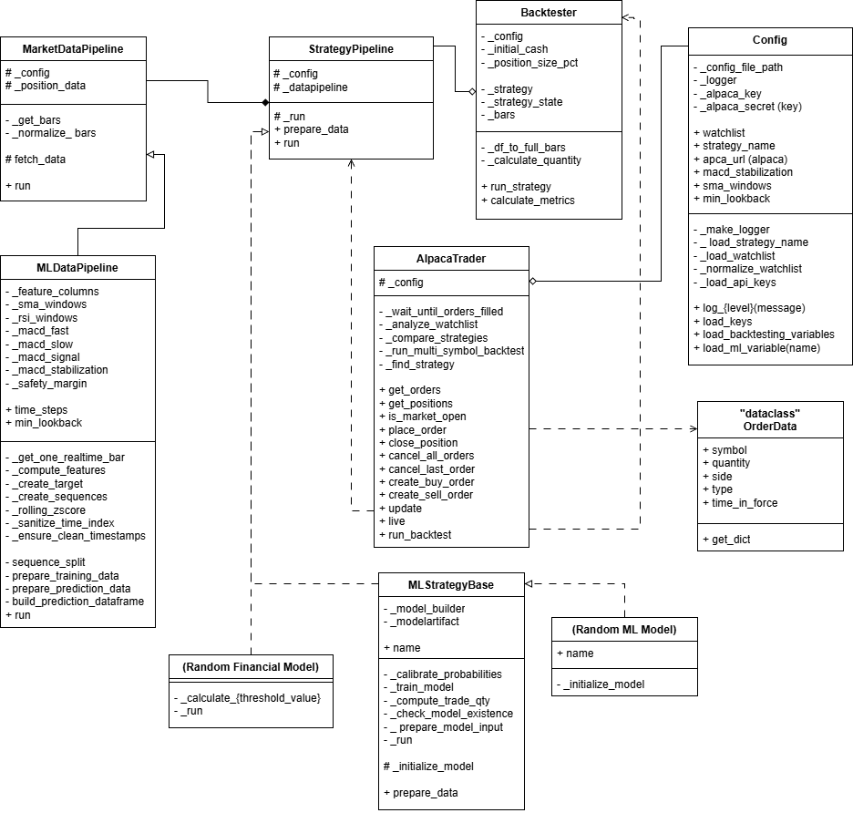
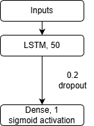

<h1 align = "center"> Live-Trading-Platform </h1>

**Year:** 2025

**Team members:** \
Milad Tootoonchi \
Makka Dulgaeva

***
<h2 align = "center"> Table of Contents </h2>

1. [Introduction](#introduction)  
    - [Usage of AI](#usage-of-ai)  
    - [Preface](#preface)
2. [Background](#background)  
    - [Problem Statement](#problem-statement)
3. [Theory & Key Concepts](#theory--key-concepts)  
    - [What is FinTech?](#what-is-fintech)  
    - [Introduction to Alpaca](#introduction-to-alpaca)  
    - [Concepts for Strategies](#concepts-for-strategies)  
    - [Backtesting](#backtesting)
4. [Program Design](#program-design)  
    - [Program Directory Architecture](#program-directory-architecture)  
    - [ML-Model Architecture](#ml-model-architecture)  
    - [Data & Data Collection](#data--data-collection)  
    - [Manual (How to use the program)](#manual-how-to-use-the-program)
5. [Results](#results)  
    - [Backtesting Results](#backtesting-results)  
    - [Machine Learning Results](#machine-learning-results)
    - [Live-Testing](#live-testing)
6. [Discussion](#discussion)  
    - [Future Work](#future-work)
7. [References](#references)

<br>

***

<h2 align = "center"> Introduction </h2>

<h3 align = "center"> Usage of AI </h3>

According to NMBU guidelines on the use of artificial intelligence (AI) we confirm the usage of the AI tool ChatGPT as a writing assistant. The tool was applied to improve grammar, sentence clarity, and academic phrasing, but it did not generate content, arguments, or analysis for us. All ideas, data interpretations, and theoretical explanations in the report are our own and based on the sources listed in the reference section. The use of ChatGPT is limited to language refinement and does not influence the academic content of the work.

<h3 align = "center"> Preface </h3>

The financial markets operate as a vast and intricate system, where millions of traders make decisions in real time, striving to outperform one another. Historically, human intuition and experience dominated this space. Stock exchanges were filled with traders engaging in open outcry, making rapid decisions based on their expertise and instincts. 

However, the landscape has undergone a significant transformation. Human traders are no longer the primary force driving the markets. Instead, algorithmic trading systems have taken precedence operating silently, with extraordinary speed and efficiency. These systems analyze vast quantities of data within milliseconds, executing trades far beyond human capability. 

Despite their perceived complexity, trading algorithms are not a product of chance. They are meticulously designed by financial professionals and engineers, programmed to follow specific strategies and navigate market fluctuations with precision. This project serves as an opportunity to understand the mechanisms behind algorithmic trading, how these systems function, how they execute decisions, and how one can develop a fundamental algorithmic trading model. 

Since the inception of commerce, societies have engaged in trade, progressing from ancient marketplaces to highly sophisticated stock exchanges. Today, finance is experiencing a paradigm shift, largely driven by advancements in technology, changes that occur beyond the immediate perception of most individuals. 

Financial Technology (FinTech) has revolutionized the management of financial transactions, encompassing innovations such as online banking, digital payments, and cryptocurrencies. At the forefront of this revolution is algorithmic trading, wherein computational models, rather than human judgment, dictate trading decisions. 

Modern trading success is no longer solely reliant on human intuition; rather, it is increasingly determined by data analysis, strategic modeling, and automation. This project presents an opportunity to engage with algorithmic trading by designing and testing a Python-based trading model, one that makes objective, data-driven decisions, free from emotional bias. 

***

<h2 align = "center"> Background </h2>

A useful analogy for algorithmic trading is that of a predator in its natural habitat, constantly surveying its surroundings, detecting patterns, and responding with precision. Similarly, an algorithmic trading system continuously monitors market trends, identifies potential opportunities, and executes transactions at high velocity. 

These systems operate around the clock, analyzing stocks, cryptocurrencies, and other financial instruments, identifying price discrepancies that may yield profit. However, despite their efficiency, success in algorithmic trading is not guaranteed. Financial markets are inherently unpredictable, requiring continuous adaptation. A strategy that proves effective today may become obsolete in the future. 

Thus, algorithmic trading systems must undergo regular refinement and optimization, evolving in response to shifting market conditions, much like any adaptive system seeking longterm viability in a competitive environment. This project will allow us to step into this world, to create a trading algorithm and test its survival in a simulated market, where only the most effective strategies endure. 

<h3 align = "center"> Problem Statement </h3>

Traditional trading methods often depend on manual decision-making processes, which are both time-intensive and prone to human error. In contrast, algorithmic trading utilizes data-driven strategies to improve execution speed, efficiency, and consistency. However, the development of a robust trading algorithm necessitates a comprehensive understanding of several key areas: 

- Financial markets and trading strategies 

- Market data processing and analysis 

- Automated trade execution using APIs 

- Risk management and performance evaluation 

To bridge the gap between theoretical knowledge and practical application, this project aims to develop a Python-based trading bot capable of analysing market trends, executing trades, and assessing strategy performance within a simulated paper trading environment.

The overall goal is to develop an automated trading system.  
In order to achieve this the following objectives and activities has been set:

1. Research 

    - Conduct a theoretical review of key concepts, including: 
        - Introduction to FinTech 
        - Algorithmic Trading and Market Access 
        - Trading Strategies and Back testing 
        - Introduction to Python for Trading 

    - Identify state-of-the-art open-source solutions through a technical review. 
    - Summarize findings and propose a project specification. 

2. Development/Method 

    - Develop a system for deploying a trading strategy based on selected indicators and predefined rules. 
        - Propose system architecture  
        - Data pipeline- Retrieve, clean, and structure real-time and historical market data using Alpaca’s API. 
        - Development of algorithm  
        - Implement a back testing framework to evaluate the strategy’s effectiveness using historical data. 

    - Deploy the strategy in a simulated trading environment using Alpaca’s paper-trading API. 
    - Summarize findings and insights from the development process. 

3. Evaluation 

    - Suggest a test plan which measure return, risk, and stability based on back testing results and compare with Alpaca’s paper-trading performance. 
        - Analyse the strategy’s robustness by testing it under different market conditions and evaluating its sensitivity to parameter changes. 
        - Assess execution speed and identify potential technical bottlenecks. 
        - Assess key performance metrics, including profit/loss, drawdown, and risk management. 
    - Summarize evaluation results and insights. 

4. Recommendations and Further Work 

    - Provide suggestions for improving the trading strategy based on evaluation results. 
    - Identify areas for future research and potential enhancements, such as alternative indicators, improved risk management, or AI-based optimizations. 

5. Limitations   

    - The project relies on Alpaca’s API for paper trading, which doesn’t account for real-world factors like slippage or liquidity issues. 
    - The use of Python limits performance due to its relative speed compared to other programming languages. 
    - The project focuses mainly on technical indicators, which may not adapt well to changing market conditions. 
    - The back testing framework is based on historical data, which may not predict future market behaviour accurately. 
    - Risk management is limited by predefined parameters and lacks exposure to real capital. 
    - The project refrain from utilizing the shorter strategy in our approach. 

***

<h2 align = "center"> Theory & Key Concepts </h2>

This chapter provides an overview of the key concepts essential for developing an automated trading system. It covers topics such as FinTech, algorithmic trading, trading strategies, and backtesting. Additionally, it introduces Python’s role in implementing trading strategies and interacting with platforms like Alpaca. Understanding these concepts will lay the foundation for creating and evaluating a successful trading strategy. 

<h3 align = "center"> What is FinTech? </h3>

Financial technology, or fintech, refers to the use of innovative technologies to deliver and improve financial services. From mobile banking and digital wallets to blockchain and algorithmic trading, fintech is transforming how individuals, businesses, and institutions interact with money. 

Driven by advancements in software, data analytics, and connectivity, fintech has disrupted traditional banking models by offering faster, cheaper, and more accessible solutions. It enables everything from peer-to-peer payments and robo-advisors to crowdfunding platforms and decentralized finance (DeFi).

<br>

 \
Figure 1: The usage of FinTech

<br>

At its core, fintech blends finance and technology to increase efficiency, enhance customer experiences, and open up new opportunities for financial inclusion across the globe. As digital adoption continues to rise, fintech is reshaping the future of finance—making it more agile, intelligent, and customer-focused than ever before.

“Algorithmic trading is a process for executing orders utilizing automated and pre-programmed trading instructions to account for variables such as price, timing and volume.

<br>

:max_bytes(150000):strip_icc()/dotdash_Final_Algorithmic_Trading_Apr_2020-01-59aa25326afd47edb2e847c0e18f8ce2.jpg) \
Figure 2: An algorithm is a set of directions for solving a problem. Computer algorithms send small portions of the full order to the market over time.” - Investopedia. 

<br>

<h3 align = "center"> Introduction to Alpaca </h3>
In today’s digital-first economy, efficient and flexible market access is a critical component for individual and institutional investors alike. Market access refers to the ability to interact with and trade within financial markets, including stock exchanges, forex, and derivatives markets. The evolution of financial technology has enabled new forms of market access-through APIs, low-latency trading platforms, and algorithmic interfaces—empowering developers and traders to automate strategies and engage with global markets in real-time. 

One of the prominent platforms facilitating this innovation is Alpaca Markets. Alpaca is a modern commission-free brokerage platform that offers robust APIs for trading U.S. stocks and ETFs. Designed with developers in mind, Alpaca provides real-time market data, paper trading environments, and order execution capabilities through simple REST and WebSocket interfaces. Its emphasis on algorithmic and programmatic trading makes it an attractive solution for fintech startups, quantitative traders, and academic researchers exploring financial automation. 

<br>

 \
Figure 3: How Alpaca API works

<br>

By lowering the barriers to entry, Alpaca represents a shift toward democratizing financial markets—offering accessible, scalable, and customizable trading infrastructure. This project explores the fundamentals of market access and highlights how Alpaca Markets enables seamless integration of trading algorithms, portfolio management, and data-driven investment strategies. 

<h3 align = "center"> Concepts for Strategies </h3>

The decision to buy or sell financial securities uses a predetermined algorithm, with the intent to make a profit. In this platform, this algorithm is a python script which can take historical data as an input and give a decision to buy / sell / hold as output. 

In trading, there are several key strategies that guide decision-making. These strategies can be automated through algorithmic trading systems, allowing for faster and more efficient execution of trades based on specific signals and market conditions. 

- **Momentum:** This strategy involves buying stocks that are trending upward or selling those that are trending downward, with the expectation that these trends will continue. Traders rely on the idea that strong trends often persist for a period. 

- **Mean Reversion:** Traders using this strategy believe that stock prices will eventually return to their historical average. As a result, they buy stocks that are undervalued and sell those that are overpriced, expecting price corrections. 

- **Moving Average Strategies:** Comparing the stock’s current price with its moving averages (20-day, 50-day, 200-day) to generate buy/sell signals. 

- **RSI (Relative Strength Index):** Used to determine whether a stock is overbought (RSI > 70) or oversold (RSI < 30), providing potential buy/sell signals.

- **MACD (Moving Average Convergence Divergence):** A momentum indicator based on the crossover of the MACD line and the signal line, used for buy/sell decisions.

- **Bollinger Bands:** Utilized to measure stock volatility and potential price movements based on the distance between the upper and lower bands.

- **Rule based strategy:** A simple strategy where the program sends buy / sell / hold signals based on close-price thesholds. Only position data is needed here.

- **Neural nettworks:** A neural network is a type of machine learning model inspired by the human brain, consisting of interconnected nodes, or "neurons," arranged in layers. These networks learn from data by processing information and adjusting the strength of connections between neurons to recognize patterns, make predictions, and solve complex problems. 
    - **RNN (LSTM):** A recurrent neural network (RNN) is a type of neural network with a feedback loop that allows it to process sequential data by using past information to influence current outputs. A Long Short-Term Memory (LSTM) is a specialized type of RNN designed to handle long-term dependencies in data more effectively, using memory cells with gates to control the flow of information over time. This ML-model will predict if the stock will rise or fall the next day, a simple classification prediction. The quantity of the order will be calculated seperatly using the probability of the prediction, this model will hold if the quantity is calculated to be 0.

<br>

 \
Figure 4: (Ajay, 2022) The figure shows us different trading strategy methods based on MACD and RSI

<br>

<h3 align = "center"> Backtesting </h3>

Backtesting and paper trading are essential steps in developing a successful trading algorithm, as they help evaluate performance before risking real capital. Backtesting involves running a strategy on historical market data to assess its effectiveness, while paper trading allows traders to simulate live market conditions without actual financial risk.

These methods help identify weaknesses, optimize parameters, and build confidence in a strategy. Without proper testing, traders risk deploying flawed algorithms that may perform poorly in real world conditions, leading to significant losses. 

Creating a profitable trading algorithm comes with several challenges, including overfitting and market risks. Overfitting occurs when an algorithm is too closely tailored to past data, making it ineffective in future market conditions. Additionally, market risks such as volatility, slippage, and unexpected economic events can negatively impact a strategy’s performance. Developing a robust algorithm requires careful optimization, risk management techniques, and continuous adaptation to changing market dynamics. Without addressing these challenges, even a well designed algorithm may fail to generate consistent profits. 

***
<h2 align = "center"> Program Design </h2>

**Tools Used:** 
- Python 
- Alpaca

**Packages**
- alpaca
- alpaca_trade_api
- alpaca-py
- requests
- numPy
- Ppandas
- matplotlib
- seaborn
- scikit-learn
- scipy
- tensorflow
- scikeras
- toml
- python-dotenv

**Main Deliverables:**
- A Python-based trading algorithm 
- A backtesting framework for evaluating performance 
- A report on strategy effectiveness and areas for improvement 

**Target Audience:** New students learning about FinTech and algorithmic trading 

**Success Criteria:** A functional trading bot that executes simulated trades with basic performance metrics 

<h3 align = "center"> Program Directory Architecture </h3>

 \
Figure 5: The program architecture shows how the different packages communicate with each other.

<br>

 \
Figure 6: The diagram shows how the *AlpacaTrader* object communicates with strategies, configuration and the main function.

<br>

<h4 align = "left"> ML-Model Architecture </h4>

 \
Figure 7: The LSTM model architecture.

**model compile settings** \
loss: binary crossentropy, \
optimizer = adam, \
metric = accuracy \
test metric = f1-score

<br>

<h4 align = "left"> Data & Data Collection </h4>
The dataset contains historical stock price information retrieved from the Alpaca API. Each entry includes a timestamp along with standard market fields such as open, high, low, close, volume, trade count, and VWAP. The data is structured as a time series, making it suitable for predictive modeling. All market data are obtained directly from the Alpaca Market Data API, which provides exchange reported price and volume information. The dataset reflects real trading activity and is used both for machine-learning-based prediction and does not include preprocessing for rule-based or financial strategy testing.

Typical issues found in financial time-series data may appear:
- Missing values due to market closures, low-liquidity periods, or incomplete API responses.
- Rolling-window NaNs, which naturally occur when computing SMA, RSI, MACD, and similar indicators.
- Outliers and sharp price movements, reflecting real market volatility.
- Inconsistent or duplicated timestamps, depending on API frequency and sampling settings.
- Distribution mismatch if real-time data is not preprocessed in the exact same way as training data.

<br>

**Preprocessing Steps (Cleaning, Transformations, Feature Engineering)**

This projects pipeline applies structured and repeatable transformations:

1. Timestamp normalization

    - Reset index, convert timestamps to datetime, and re-index the DataFrame using the timestamp.

2. Feature engineering (technical indicators)

    - Moving averages: SMA5, SMA20, SMA50

    - Price change: first difference of close price

    - RSI (14-period)

    - MACD and MACD Signal line (EMA-based)

3. Data cleaning

    - Removal of all rows containing NaN values created by rolling or EMA computations.

4. Target variable construction (training only)

    - Binary target indicating whether the next closing price is higher than the current one.

5. Scaling

    - StandardScaler is fit on the training features.

    - During real-time prediction, the same scaler is used to transform incoming data without refitting.

6. Real-time prediction preparation

    - Applies the identical feature engineering pipeline.

    - Does not create targets and does not refit the scaler.

    - Drops NaNs and returns only the scaled feature matrix for model inference.

7. Rule-based / financial strategies

    - These strategies use raw market data and do not involve scaling or preprocessing steps.

<br>

**Challenges and Constraints**

- Minimum data requirements: Indicators like SMAs and RSI require several past observations, reducing usable data at the beginning.

- Real-time consistency: Maintaining identical processing between training and inference is critical to avoid data leakage or drift.

- Volatility and noise: Market noise can weaken predictive performance and require robust feature engineering.

- Potential timestamp irregularities from the Alpaca API, which may affect rolling calculations.

- Computational cost when recalculating indicators continuously for real-time predictions.

- Model sensitivity to scaling errors or missing values if real-time data differ structurally from the training distribution.

<br>

<h3 align = "center"> Manual (How to use the program) </h3>

**<h4>Prerequisites</h4>**

**How to Locate Your Alpaca API Keys:**

1. **Log in to Your Alpaca Account**  
   Navigate to the Alpaca website and sign in with your registered username and password.

2. **Access the Dashboard**  
   After logging in, you will be taken to the main dashboard. If not, select **Dashboard** from the menu.

3. **Open the API Keys Section**  
   In the left-hand navigation panel, select **API Keys** or **Your API Keys**, depending on your account view.

4. **Select the Appropriate Environment**  
   Choose between:
   - **Paper Trading** (for testing)
   - **Live Trading** (for real transactions)  
   Each environment has its own set of keys.

5. **Reveal the Keys**  
   Click **Generate** (if no keys exist) or **View**/**Reveal** (if keys are already created).  
   You will see two values:
   - **API Key ID**
   - **Secret Key**

6. **Copy and Store the Keys Securely**  
   Copy both keys and store them in the *settings.toml* file under *[keys]* **section with quote marks around the keys ("*key*")**.  
   *Do not share these keys publicly.*

7. **Regenerate if Needed**  
   If you suspect your keys have been exposed, you can select **Regenerate** to create new ones.  

<br>

**Strategies:** \
This prerequisite is not necessary since the program will ask you for your perfered strategy if the program can not find it in the *settings.toml* file. If you wish to write down your perfered strategy, store the name of the strategy under the *[live]* section as strategy (e.g. strategy = "ai"). **Remember to put quote marks around the strategy name**.  

These are the strategy names you can choose from.  
*Warning: the name of the strategy should be exactly similar to one of the strategy names bellow.*
- rule_based_strategy
- bollinger_bands_strategy
- macd_strategy
- mean_reversion_strategy
- momentum_strategy
- moving_average_strategy
- rsi_strategy
- ai

*We would recomend the rsi_strategy or the ai for the time being.*

<br>

**Watchlist:** \
This feature is optional. If you want the program to always analyze specific stocks, even when you do not currently hold a position, you can define a watchlist.
Add the stock symbols to the [live] section as a Python list, for example:
```toml
[live]
watchlist = ["AAPL", "GOOG", "SPY"]
```
Important:
- Symbols must be enclosed in quotation marks
- The list must be enclosed in square brackets ([ ])
- Separate symbols with commas

<br>

**How to Install the Required Python Packages:**

Follow these short steps to set up your environment:

1. Install Python
    - Make sure Python 3.11 or newer (but < 4.0) is installed:
    ```bash
    python --version
    ```
2. Install Poetry
    - If you do not already have Poetry installed:
    ```bash
    pip install poetry
    ```
    - Verify installation
    ```bash
    poetry --version
    ```
4. Install dependencies
    - This will create a virtual environment and install the locked dependencies:
    ```bash
    poetry install
    ```
    - To update dependencies to newer compatible versions:
    ```bash
    poetry update
    ```

<br>

**<h4> Usage Guide:</h4>**

The steps below explain how to use its different command-line options.

1. Open a Terminal
    - Navigate to the main directory where the program is located.

2. Run the Program with a Command.
    - The program accepts several command-line flags.  
    - Use this format:
    ```bash
    poetry run trade [flag]
    ```

3. First you need to place an buy-order (if you do not have any positions in your portfolio).
    - *--buy* or *-b*
    ```bash
    poetry run trade --buy
    ```
- If you need to place an sell-order.
    - *--sell* or *-s*
    ```bash
    poetry run trade --sell
    ```

- Cancel last given order (if you regret sending the last given orders)
    - *--cancel-last* or *-cl*
    ```bash
    poetry run trade --cancel-last
    ```

- Cancel all open orders (if you regret sending every recent order)
    - This will cancel **all** open orders.
    - *--cancel* or *-c*
    ```bash
    poetry run trade --cancel
    ```

* Update a specific position or all positions
    - Evaluates specifies / all positions using a strategy chosen at startup. Makes an order based on the evaluation.
    - *--update* or *-u*
    ```bash
    poetry run trade --update [stock symbol, or 'ALL' for all positions]
    ```

* Run the Live Trading Loop
    - This will run an update every 60 seconds on ALL positions.
    - *--live* or *-l*
    ```bash
    poetry run trade --live
    ```


<br>

***

<h2 align = "center"> Results </h2>

This chapter presents the results from the one week live-testing, the backtesting of the rule-based strategies, as well as the evaluation of the machine-learning LSTM model. The goal is to provide an overview of how the strategies performed historically and to assess whether the ML model was able to detect short-term price movements. These results also form the basis for later discussion and improvement.

<h3 align = "center"> Backtesting Results </h3>

Backtesting was performed on several different strategies using historical TSLA data. The results clearly show that the strategies vary significantly in terms of total return, risk, and the number of trades executed. The table below summarizes the key performance metrics:

| Strategy           | Total Return (%) | Sharpe Ratio | Max Drawdown (%) | Number of Trades | Win-rate (%) |
|-------------------|------------------|--------------|------------------|------------------|--------------|
| **RSI**           | **178.2**        | 1.07         | -26.38           | 333              | 0.0          |
| **Mean Reversion**| 138.0            | 0.64         | -59.34           | 917              | 0.0          |
| **Bollinger Bands**| 42.28           | 0.74         | -12.99           | 138              | 0.0          |
| **MA**            | 1.35             | 0.16         | -63.13           | 125              | 0.0          |
| **MACD**          | -0.53            | 0.03         | -16.14           | 80               | 0.0          |
| **Momentum**       | -22.56          | -0.07        | -44.85           | 1034             | 0.0          |

Although the win-rate is 0% for all strategies (which is a limitation of the simplified trade-execution logic used in the backtester), the **RSI strategy stands out as the best performer**, achieving the highest total return and the strongest Sharpe ratio. The more aggressive Mean Reversion strategy also performed well, but at the cost of a significantly larger drawdown.

Strategies such as MACD, Moving Average, and Momentum struggled, with the Momentum strategy performing the worst overall and showing high sensitivity to market noise. These mixed results highlight that simple rule-based strategies can work under certain market conditions but are far from reliable across all scenarios.

<br>

<h3 align = "center"> Machine Learning Results </h3>

The machine-learning model was evaluated using a classification approach, where the LSTM attempts to predict whether the next day’s closing price would increase or decrease. The confusion matrix and classification report provide insight into the model’s predictive ability.

The final test performance was:

- **Best logged test F1-score:** 0.6898  
- **Validation accuracy:** 0.5387  

The full classification report for the final model is shown below:  

          precision    recall  f1-score   support  

       0     0.4308    0.2314    0.3011       121  
       1     0.5485    0.7533    0.6348       150  

accuracy                         0.5203       271

macro avg 0.4897 0.4924 0.4680 271  
weighted avg 0.4960 0.5203 0.4858 271

The model performs noticeably better on class 1 (predicting that the stock will rise), achieving over 0.75 recall, meaning it correctly identifies most upward movements. However, it struggles with class 0 (predicting a drop), leading to lower balance between the classes.

Overall, the ML model performs only slightly above random guessing but shows potential. The relatively strong F1 score for class 1 indicates that the model might be useful in optimistic or rising markets, although the overall accuracy remains modest. More advanced tuning, regularization, and feature engineering would likely improve general performance.

<br>

<h3 align = "center"> Live-Testing </h3>

During the first few days of live-testing, the platform ran on the RSI strategy, which turned out to be very slow and careful. The system waited for the RSI value to move clearly above or below the chosen thresholds before sending any trading signals, which resulted in fewer trades and slower reactions. After three to four days, the strategy was switched over to the AI model instead, since it was expected to take on more risk by using predictions from a simple LSTM-50 model. For the test week, the program started with two shares each in AMD, PLTR, INTC, AVGO, NVDA, GOOGL, and SPY. By the end of the week, the realized PnL reached 751,894.59, matching the total PnL, while both account equity and portfolio value ended at 1,010,352.08. This gave a return of around 290.9%. Even though the results look unusually high, the test clearly shows that the AI strategy behaved much more aggressively and caught more short-term market movements compared to the original RSI or other rule based approaches.

<br>

realized_pnl        | total_pnl           | equity            | cash                  | portfolio_value      | roi_equity_percent
|-------------------|---------------------|-------------------|-----------------------|----------------------|------------------|
751894.5900000003   | 751894.5900000003   | 1010352.08        | 1010352.08            | 1010352.08           | 290.9161541420221

<br>

***

<h2 align = "center"> Discussion </h2>

The results from both the backtesting and the machinelearning evaluation highlight several important strengths and limitations of the current system. While the project successfully demonstrates a functional algorithmic trading framework, the findings suggest multiple areas where the system can be improved, both technically and conceptually.

From the backtesting results, it is clear that the rule-based strategies behave very differently depending on market conditions. The RSI strategy performed exceptionally well, showing both strong returns and a relatively favorable risk profile. However, other strategies, such as MACD, Moving Average, and especially Momentum, performed poorly and showed high susceptibility to volatility and noise. This indicates that simple indicator-based strategies may not generalize well and are highly dependent on the underlying market regime. Additionally, the 0% win-rate across all strategies reveals a limitation in the trade execution logic within the backtester, meaning that the results should be interpreted with caution. Improving this mechanism would lead to more realistic performance metrics.

On the machinelearning side, the LSTM model showed moderate performance. With a best F1-score of 0.6898 and an accuracy slightly above random, the model does capture some meaningful patterns, especially for predicting upward movements. However, the imbalance in class performance, combined with the overall accuracy of around 52%, shows that the model still struggles with market noise and rapid price fluctuations. More regularization, such as dropout, early stopping, and possibly batch normalization would likely improve the model’s generalization ability. Furthermore, the model’s reliance on only price derived features limits its predictive power, which could be addressed by incorporating additional features like volume-based indicators, macroeconomic data, or alternative data sources.

<h3 align = "center"> Future Work </h3>

There are several clear directions for future improvement. It is advised that anyone attempting to recreate the program should keep the following points in mind for their own versions:

1. **More advanced ML architecture**  
   While it is tempting to use more complex architectures, for example deeper LSTMs, GRUs, CNN-LSTM hybrids, or even transformer models complexity does not always lead to better performance, especially in noisy financial time-series data. A more controlled approach would be to improve preprocessing, expand the feature set, and tune hyperparameters more systematically before moving to more advanced architectures.

2. **Enhanced program architecture**  
   The current system could benefit from a cleaner object oriented structure. Improving communication between modules would make the codebase easier to extend, debug, and maintain. A more modular design would also support plugging in additional strategies or ML models without restructuring large parts of the system.

3. **Better trade-execution handling**  
   A useful improvement would be adding more flexible order-management logic. For example:
   - Allowing the user to cancel only the most recent order rather than all active orders.  
   - Providing an option to temporarily deactivate automated order placement.  
   - Enabling the AI strategy to open a new position in a stock even if the portfolio currently holds no shares of it.

4. **Improving the ML pipeline**  
   Adding stronger regularization, experimenting with different window sizes, and applying better validation techniques (e.g., walk-forward validation) would likely make the ML predictions more robust. Additionally, integrating early stopping could prevent overfitting and improve the model's stability during training.

Overall, while the platform already demonstrates the core functionality of an algorithmic trading system, there is significant potential for refinement. With improvements in model design, program structure, and risk management, the system could evolve into a more reliable and realistic trading environment capable of supporting more advanced strategies and tools in the future.

<br>

***

<h2 align = "center"> References </h2>

Alpaca Markets. (2024). *Alpaca API documentation*. https://docs.alpaca.markets/

Hochreiter, S., & Schmidhuber, J. (1997). Long short-term memory. *Neural Computation, 9*(8), 1735–1780. https://doi.org/10.1162/neco.1997.9.8.1735

Hunter, J. D. (2007). Matplotlib: A 2D graphics environment. *Computing in Science & Engineering, 9*(3), 90–95.

McKinney, W. (2010). Data structures for statistical computing in Python. In *Proceedings of the 9th Python in Science Conference* (pp. 51–56). SciPy.

NMBU. (2025). *Retningslinjer for bruk av kunstig intelligens (KI) ved NMBU*. https://www.nmbu.no/retningslinjer-bruk-av-kunstig-intelligens-ki-ved-nmbu

Pedregosa, F., Varoquaux, G., Gramfort, A., Michel, V., Thirion, B., Grisel, O., ... & Duchesnay, É. (2011). Scikit-learn: Machine learning in Python. *Journal of Machine Learning Research, 12*, 2825–2830.

Raschka, S., & Mirjalili, V. (2019). *Python machine learning* (3rd ed.). Packt Publishing.

Seaborn Development Team. (2024). *Seaborn statistical data visualization*. https://seaborn.pydata.org

TensorFlow Team. (2024). *TensorFlow machine learning platform*. https://www.tensorflow.org/

Van Rossum, G., & Drake, F. L. (2009). *Python 3 reference manual*. CreateSpace.

OpenAI. (2025). *ChatGPT (Version 5.1)* [Large language model]. https://www.openai.com  
(*Used as a writing assistant for sentence clarity, structure and wording.*)

Investopedia. (2022). *Algorithmic trading: Definition, how it works, pros & cons*. https://www.investopedia.com
