## User Manual (How to use the program)

* This application is still under development. At this stage, you may need to launch or run the application in developer mode to use it.

### **Prerequisites**

**How to Locate Your Alpaca API Keys:**

1. **Log in to Your Alpaca Account**  
   Navigate to the Alpaca website and sign in with your registered username and password.

2. **Access the Dashboard**  
   After logging in, you will be taken to the main dashboard. If not, select **Dashboard** from the menu.

3. **Open the API Keys Section**  
   In the left-hand navigation panel, select **API Keys** or **Your API Keys**, depending on your account view.

4. **Select the Appropriate Environment**  
   Choose between:
   - **Paper Trading** (for testing)
   - **Live Trading** (for real transactions)  
   Each environment has its own set of keys.

5. **Reveal the Keys**  
   Click **Generate** (if no keys exist) or **View**/**Reveal** (if keys are already created).  
   You will see two values:
   - **API Key ID**
   - **Secret Key**

6. **Copy and Store the Keys Securely**  
   Copy both keys and store them in the *settings.toml* file under *[keys]* **section with quote marks around the keys ("*key*")**.  
   *Do not share these keys publicly.*

7. **Regenerate if Needed**  
   If you suspect your keys have been exposed, you can select **Regenerate** to create new ones.  

<br>
<br>

**How to Install the Required Python Packages:**

Follow these short steps to set up your environment:

1. Install Python
    - Make sure Python 3.11 or newer (but < 4.0) is installed:
    ```bash
    python --version
    ```
2. Install uv
    - If you do not already have uv installed:
    ```bash
    curl -LsSf https://astral.sh/uv/install.sh | sh
    ```
    - Verify installation
    ```bash
    uv --version
    ```

3. Navigate to backend
   ```bash
   cd backend
   ```

3. Create a Virtual Enviroment
   ```bash
   uv venv
   ```
   - Activate the enviroment
   ```bash
   source .venv/bin/activate
   ```

4. Install dependencies
    - This will install the locked dependencies from uv.lock:
    ```bash
    uv sync
    ```
    - To update dependencies to newer compatible versions:
    ```bash
    uv lock --upgrade
    uv sync
    ```

5. Run backend API
   ```bash
   uv run main.py
   ```

<br>
<br>

### **How to open app**

Follow the short steps to open your app in another terminal while the first terminal runs (DO NOT CLOSE THE FIRST TERMINAL):

1. Navigate to frontend
   * If you are located in backend run:
   ```bash
   cd ../frontend
   ```
   * If you are located in the root file run:
   ```bash
   cd frontend
   ```

2. Install dependencies
   ```bash
   npm install
   ```

3. Run application with:
   ```bash
   npm run dev
   ```

4. Open your favorite web browser and enter the following URL in the address bar to open the application:
   * <http://localhost:3000/>

<br>
<br>

### **User Guide:**

The steps below explain how to use the app:

1. Navigate to settings page  
   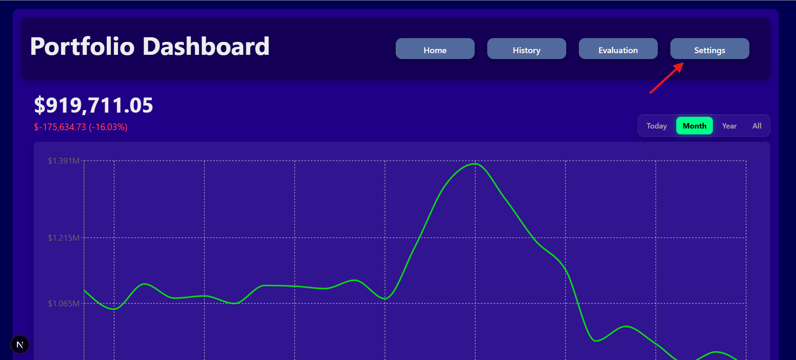

2. Paste your Alpaca key and secret-key  
   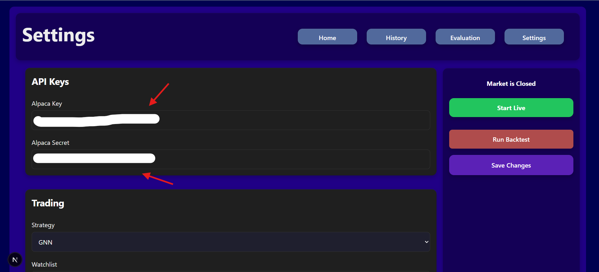

3. Choose the strategy you would like to use  
   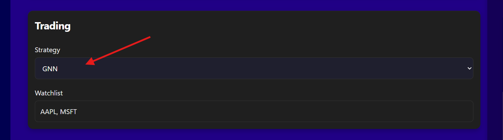

4. Enter the stock symbols you want the AI to analyze
   * *If this list is empty, the AI will only make predictions for stocks in which you already hold a position.*
   * **Remember to separate the symbols with commas, as shown in the image below:**
   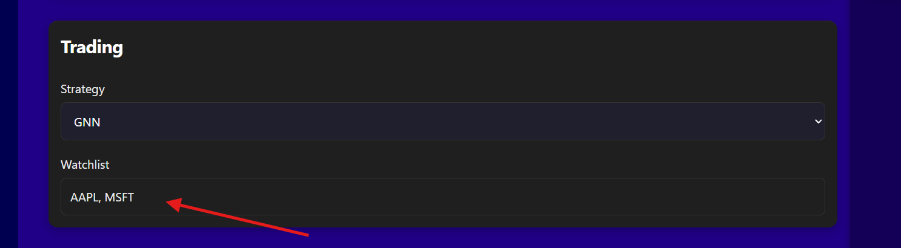

5. In the Backtesting card, you can configure the following settings:
   1. Initial Cash: the amount of cash available at the start of the backtest.
   2. Days: the number of days to include in the backtest, counting backward from today.
   3. Strategies: click a strategy to add it to the backtest. Click it again to remove it from the list.
   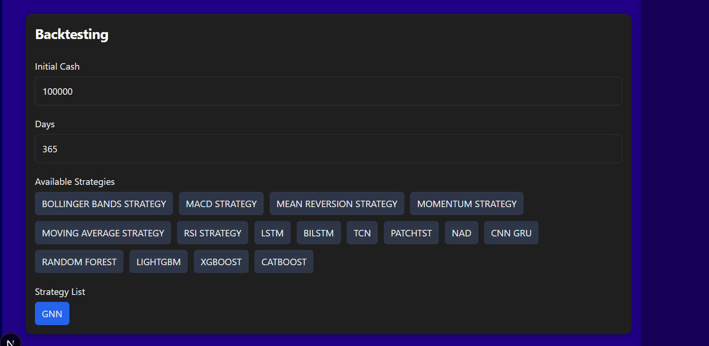

6. These settings control the AI configuration. Adjust them as needed, although the default values are suitable for most users
   * *All values must be entered as integers.*
   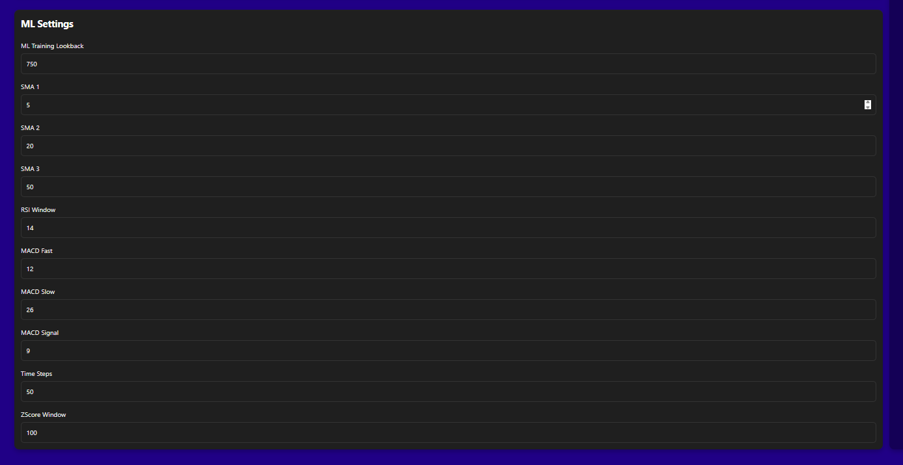

* Remember to save changes!
   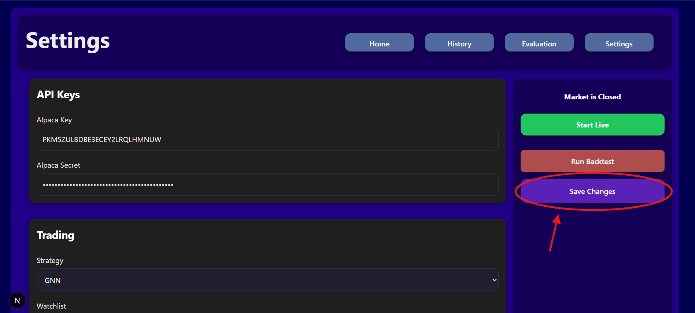

7. On all pages, you will find a green button that starts live automated trading when clicked. Click the button again to stop live trading
   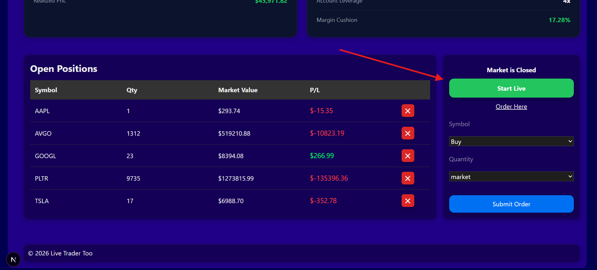

8. Below the equity chart located on the Home page there exists a ordering panel
   1. Enter the symbol of the stock you want to place an order in.
   2. Choose from buying or selling order.
   3. Enter the amount of quantities you want to order.
   4. Choose the order type.
   5. Press the "Submit Order" button to send the order.
   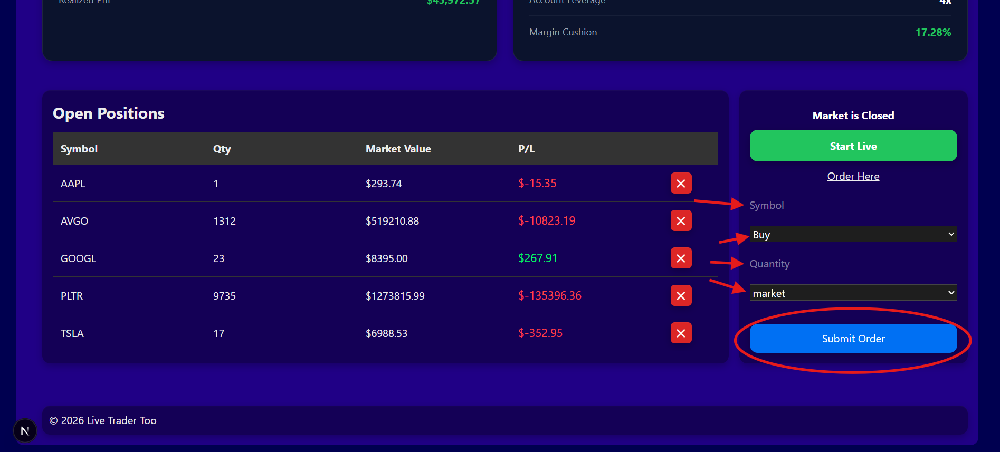

9. The History page contains logs related to AI decisions, orders, and any errors that occur
   * You will also find the Run Backtest button. The results and information generated by the backtest will be logged on this page:
   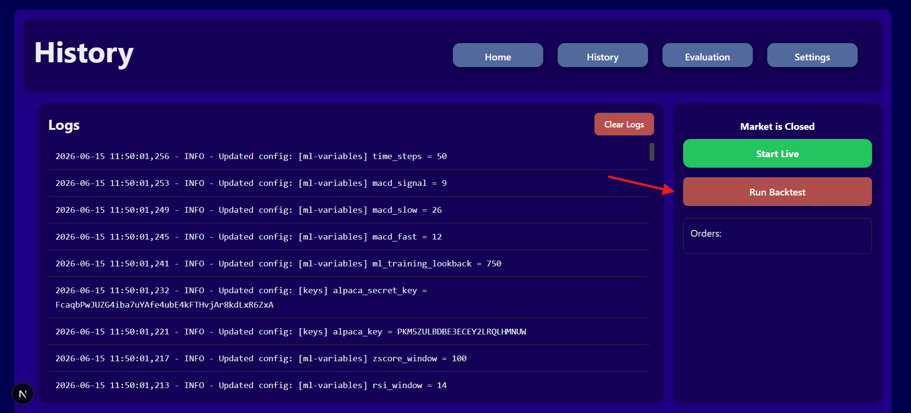

10. The Evaluation page contains the result of the backtesting and model-evaluations.
   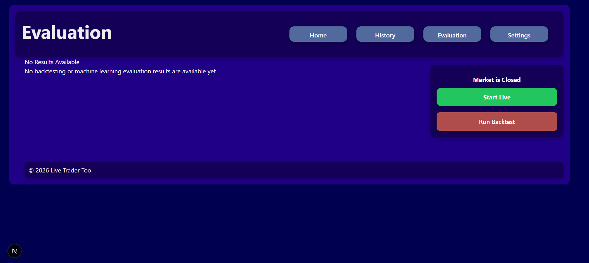